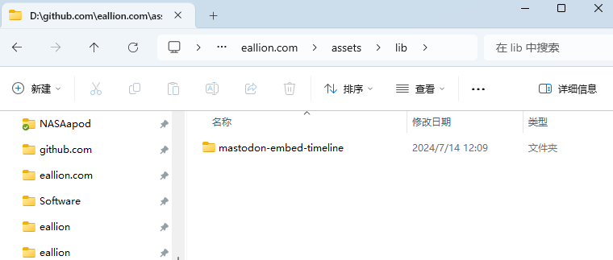
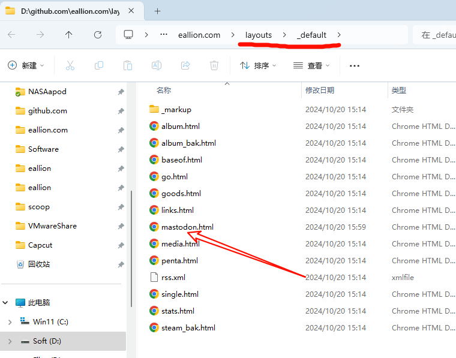
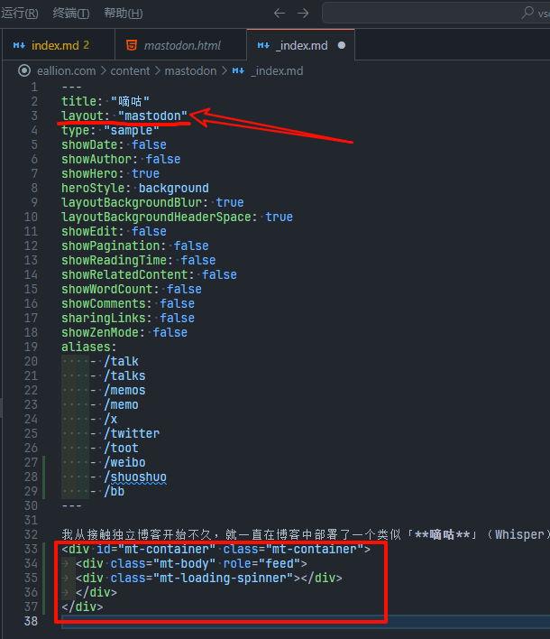

---
authors:
- eallion
categories:
- 代码
date: 2024-10-20 16:05:03+08:00
draft: false
series:
- Mastodon
slug: hugo-blog-embed-mastodon
summary: Mastodon时间线可以通过JS插件集成到各类博客中，包括Hugo、Hexo等。作者以Hugo为例，分享将Mastodon嘟文动态展示在博客中的方法。Mastodon支持API和RSS两种数据获取方式，早期采用静态渲染但构建耗时较长，现改用JS动态调用API实现实时加载。
tags:
- Mastodon
- 长毛象
- 博客
title: Hugo 博客集成 Mastodon
---

### 说明

所有博客类型（Hugo、Hexo、Wordpress 等）都可以通过这个 JS 插件集成 Mastodon。本文以 Hugo 为例。

### 前言

我的博客子栏目「[嘀咕](https://www.eallion.com/mastodon/)」这个微博客（说说、自言自语），几经变迁，现在进化到了集成 Mastodon 时间线。可以把发布在联邦宇宙中的嘟文集成到博客中来。
应邀写一篇博客整理一下实现过程。

PS：`Mastodon` 是一个专有名词，像 `Iphone` `mAcOs` 一样，别写错了，很尬。

### 选型

- API or RSS

Mastodon 提供 API（Json）和 RSS 两种信息流输出，可以选一种方式集成。

- SSG or JS

Hugo、Hexo 等 SSG 类型的博客可以构建时渲染成静态内容，也可以用 JS 动态集成。
在早期为了极致的加载速度，我采用静态渲染的方式，发布一条嘟文时，构建一次 Hugo，但是现在构建一次 Hugo 要 3 分多钟，改为用 JS 的方式实时调用 API 了。

- 我的方式：API + JS

我是用 [https://github.com/eallion/mastodon-embed-timeline](https://github.com/eallion/mastodon-embed-timeline) 这个 JS 包集成的。简单方便易维护。

预览：

- [https://www.eallion.com/mastodon](https://www.eallion.com/mastodon)
- [https://codepen.io/ipuntoj/pen/MWppNGL](https://codepen.io/ipuntoj/pen/MWppNGL)

### 安装

有 3 种方式安装 [mastodon-embed-timeline](https://github.com/eallion/mastodon-embed-timeline)

参考说明文档：[README#installation](https://github.com/eallion/mastodon-embed-timeline?tab=readme-ov-file#installation)

我选择的是通过 `git submodule` 子模块的方式加载，相当于文档中下载的安装方式。

在博客根目录执行：

```bash
git submodule add https://github.com/eallion/mastodon-embed-timeline.git assets/lib/mastodon-embed-timeline
```

把 mastodon-embed-timeline 下载到博客的 `assets/lib` 这个目录，这个目录可以随便选，只要记得这个路径就可以了。



注意事项：

1. 在另外的电脑上 Clone 博客后，要执行 `git submodule update --init --recursive` 才能同步克隆子模块。
2. 子模板有更新时，执行 `git submodule update --remote --merge` 更新子模块。

### 新建模板

在博客的根目录的 `layouts/_default` 下（没有可以创建），新建一个 `mastodon.html` 文件。按 Hugo 的构建规则 [Docs](https://gohugo.io/templates/lookup-order/) 尽量不要去 themes 的 `layouts` 目录创建，除非你本人是当前主题的开发者。
更好的方式可以从主题的 `themes/xxx/layouts/_default` 复制一个模板文件过来，改名为 `mastodon.html`。
`mastodon.html` 可以是其他名字，如 `bb.html` `shuoshuo.html` `whisper.html`



### 模板内容

> 参考：
>
> - [examples/profile-timeline.html](https://github.com/eallion/mastodon-embed-timeline/blob/master/examples/profile-timeline.html)
> - [layouts/_default/mastodon.html](https://github.com/eallion/eallion.com/blob/main/layouts/_default/mastodon.html)

模板文件 `mastodon.html` 需要与主题的结构兼容（所以最好的方法是从主题中复制一个差不多的过来），主要修改三个地方：

##### 1. 引入 CSS

在模板文件的靠前部分插入下面的 CSS。
两个方式二选一：

```html
<!-- git submodule 方式 -->
{{ $mastodonCss := resources.Get "lib/mastodon-embed-timeline/dist/mastodon-timeline.min.css" | minify | fingerprint "sha256" }}
<link rel="stylesheet" href="{{ $mastodonCss.RelPermalink }}" integrity="{{ $mastodonCss.Data.Integrity }}" crossorigin="anonymous">

<!-- CDN 方式 -->
<link rel="stylesheet" href="https://cdn.jsdelivr.net/npm/@idotj/mastodon-embed-timeline@4.4.2/dist/mastodon-timeline.min.css" integrity="sha256-1UGgxsonaMCfOEnVOL89aMKSo3GEAmaRP0ISbsWa6lU=" crossorigin="anonymous">
```

如果有自定义的 CSS 样式需要，可以参考：

- [assets/css/mastodon-timeline-custom.scss](https://github.com/eallion/eallion.com/blob/main/assets/css/mastodon-timeline-custom.scss)

##### 2. 引入 JS

在模板文件的结尾部分插入下面的 JS。
两个方式二选一，是否使用 ESM 版本的 JS 自行决定，不懂就无脑用 UMD 版本：

```html
<!-- git submodule 且 ESM 方式 -->
{{ $js := resources.Get "lib/mastodon-embed-timeline/dist/mastodon-timeline.esm.js" }}
<script type="module">
	import * as MastodonTimeline from '{{ $js.RelPermalink }}';
	const myTimeline = new MastodonTimeline.Init();
</script>

<!-- CDN 方式 -->
<script src="https://cdn.jsdelivr.net/npm/@idotj/mastodon-embed-timeline@4.4.2/dist/mastodon-timeline.umd.js" integrity="sha256-E6WPG6iq+qQIzvu3HPJJxoAeRdum5siq13x4ITjyxu8=" crossorigin="anonymous"></script>
```

##### 3. 配置 Mastodon

在引入 mastodon-timeline.umd.js 之后，修改下面这些配置（并非所有参数都需要配置）

```html
<script>
	const myTimeline = new MastodonTimeline.Init({
		// 包含时间线的 <div> 的 ID
		mtContainerId: "mt-container",

		// Mastodon 实例的 URL，包含 https://
		instanceUrl: "https://mastodon.social",

		// 选择要在时间线中显示的帖子类型：'local', 'profile', 'hashtag'
		// 默认：local
		timelineType: "profile",

		// 你在 Mastodon 实例上的用户 ID 号
		// 如果你没有选择 'profile' 作为时间线类型，请留空
		userId: "107666",

		// 你在 Mastodon 实例上的用户名（包括开头的 @ 符号）
		// 如果你没有选择 'profile' 作为时间线类型，请留空
		profileName: "@eallion",

		// 标签的名称（不包括 # 符号）
		// 如果你没有选择 'hashtag' 作为时间线类型，请留空
		hashtagName: "",

		// 加载旋转器的类名（也在 CSS 文件中使用）
		spinnerClass: "mt-loading-spinner",

		// 首选颜色主题：'light', 'dark' 或 'auto'
		// 默认：auto
		defaultTheme: "auto",

		// 向服务器请求的最大帖子数量
		// 默认：20
		maxNbPostFetch: "40",

		// 在时间线中显示的最大帖子数量
		// 默认：20
		maxNbPostShow: "20",

		// 根据选择的语言/国家指定日期格式
		// 默认：英式英语（日 - 月 - 年顺序）
		dateLocale: "en-US",

		// 使用选项自定义日期格式
		// 默认：DD MMM YYYY
		dateOptions: {
			day: "2-digit",
			month: "short",
			year: "numeric",
		},

		// 隐藏未列出的帖子
		// 默认：不隐藏
		hideUnlisted: true,

		// 隐藏转发的帖子
		// 默认：不隐藏
		hideReblog: false,

		// 隐藏回复帖子
		// 默认：不隐藏
		hideReplies: true,

		// 从个人资料时间线中隐藏置顶帖子
		// 默认：不隐藏
		hidePinnedPosts: true,

		// 隐藏用户名下的用户账号
		// 默认：不隐藏
		hideUserAccount: false,

		// 将文本内容限制为最大行数
		// 使用 "0" 表示不显示文本
		// 默认：""（无限制）
		txtMaxLines: "",

		// 自定义用于显示/隐藏敏感/剧透文本的按钮文本
		btnShowMore: "显示更多",
		btnShowLess: "显示更少",

		// 将 Markdown 符号 ">" 转换为块引用 HTML 标签
		// 默认：false（不应用）
		markdownBlockquote: false,

		// 隐藏服务器上的自定义表情符号
		// 默认：不隐藏
		hideEmojos: false,

		// 自定义用于显示敏感/剧透媒体内容的按钮文本
		btnShowContent: "显示内容",

		// 隐藏视频预览并加载视频播放器
		// 默认：不隐藏
		hideVideoPreview: true,

		// 自定义用于加载和播放视频的按钮文本
		btnPlayVideoTxt: "加载并播放视频",

		// 如果帖子包含来自 URL 的链接、照片或视频，则隐藏预览卡片
		// 默认：不隐藏
		hidePreviewLink: true,

		// 将预览文本描述限制为最大行数
		// 使用 "0" 表示不显示文本
		// 默认：""（无限制）
		previewMaxLines: "",

		// 隐藏回复、转发和点赞的帖子计数器
		// 默认：不隐藏
		hideCounterBar: false,

		// 当用户点击帖子中的图片时显示轮播/灯箱
		// 默认：不关闭
		disableCarousel: false,

		// 自定义轮播/灯箱的按钮文本
		carouselCloseTxt: "关闭轮播",
		carouselPrevTxt: "上一个媒体项",
		carouselNextTxt: "下一个媒体项",

		// 自定义指向 Mastodon 页面的按钮文本，放置在时间线末尾
		// 留空以隐藏
		btnSeeMore: "在 e5n.cc 查看更多帖子",

		// 自定义重新加载帖子列表的按钮文本，放置在时间线末尾
		// 留空以隐藏
		btnReload: "刷新",

		// 在构建时间线之前继续搜索主 <div> 容器。在某些情况下很有用，需要额外的时间来渲染页面
		// 默认：不应用
		insistSearchContainer: true,

		// 定义继续搜索主 <div> 容器的最长时间
		// 默认：3 秒
		insistSearchContainerTime: "3000",

	});

</script>
```

### 新建页面

在博客的 `content` 目录新建一个页面，如 `mastodon.md` 用来显示 Mastodon 的独立页面。有的主题的独立页面结构可能是 `mastodon/_index.md`。
Front Matter 里需要指定 `layout` 的名称，要跟模板名称对应上。

在此 `mastodon.md`（或 `_index.md`）文件中插入以下内容，用于渲染 Mastodon 的 Dom 容器：

```html
<div id="mt-container" class="mt-container">
	<div class="mt-body" role="feed">
	<div class="mt-loading-spinner"></div>
	</div>
</div>
```



小技巧：Hugo 自带 `aliases` 参数，在 Front Matter 里写上这个参数，可以把这些需要的页面重定向到此页面，不需要另外新建那些页面。

### 其他

另外我的页面中，实现了 2 个小功能：
针对国内访客，劫持图片链接，替换成国内 CDN 实现加速；
拦截白名单外的域名，添加跳转提示。
这些修改都不破坏 `git submodule` 引入的子模块的完整性。
可在源码中查看：[layouts/_default/mastodon.html](https://github.com/eallion/eallion.com/blob/main/layouts/_default/mastodon.html)