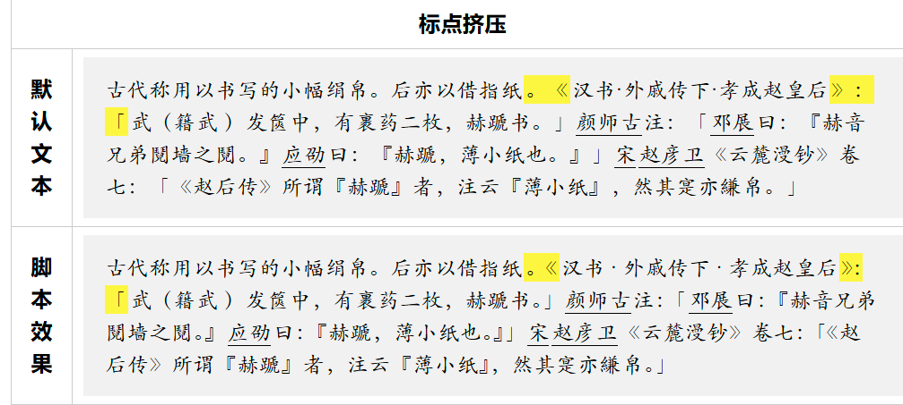

---
authors:
- eallion
categories:
- 代码
date: 2024-10-29 17:31:17+08:00
draft: false
slug: cjk-punctuation
summary: 中文全角标点连续出现时会产生多余空白。解决方案包括使用赫蹏或Han这类JS插件压缩标点间距，或通过OpenType字体的halt特性实现半角显示（需CSS设置）。建议网页设置lang属性标明语言，例如`<html
  lang="zh-cn">`。
tags:
- 博客
- 标点
- 排版
title: 博客排版 - 挤压中文标点符号
---

### 示例

连续的中文全角标点符号的默认排版样式，默认 1 个全角标点会占用 2 个字符宽度，当连续的全角标点出现时，会出现大量的空白。（可点击图片）看一个例子：
<a href="https://sivan.github.io/heti/#javascript" target="_blank"></a>

### 解决方案

如「[赫蹏](https://sivan.github.io/heti/)」（heti）就有挤压标点符号的 JS 插件；还有 [ethantw/Han](https://github.com/ethantw/Han) 也很优秀；OpenType 字体的 [halt](https://helpx.adobe.com/fonts/using/open-type-syntax.html#halt)（Alternate Half Widths）功能也可将全角字符以半角的形式显示，只需要设置 CSS 属性 `font-feature-settings: "halt"` 便可打开该特性，只是支持的字体有限。就不一一例举了。

关于中英文混合排版是另一个大的话题。

我在本地用了 [autocorrect](https://github.com/huacnlee/autocorrect) 插件，写完博客就对文章进行中英文混合排版自动格式化了，不需要在线插件，所以现在只介绍标点挤压。

#### 1. 全局属性 lang

不仅限于此插件，所有博客页面应该设置对应的 HTML 全局属性 lang：

```html
<html lang="zh-cn"></html>
```

#### 2. 引入 heti-addon

我直接用了「赫蹏」标点挤压增强脚本：

```html
<script src="//unpkg.com/heti/umd/heti-addon.min.js"></script>
```

```html
<script>
  const heti = new Heti('.heti');
  heti.autoSpacing();
</script>
```

PS：也可以把 JS 下载到本地引入，如 Hugo 下载到 assets/js 目录：

```html
{{ $hetiJS := resources.Get "js/heti-addon.min.js" | fingerprint "sha256" }}
<script type="text/javascript" src="{{ $hetiJS.RelPermalink }}" integrity="{{ $hetiJS.Data.Integrity }}"></script>
```

#### 3. 添加自定义 CSS

从 Heti.css 中提取了挤压标点用到的 CSS，添加到博客的样式文件中：

```css
/* heti custom css */
.heti {
  font-feature-settings: "halt";
}

.heti heti-spacing {
  display: inline;
}

.heti .heti-spacing-start {
  margin-inline-end: .25em;
}

.heti .heti-spacing-end {
  margin-inline-start: .25em;
}

.heti heti-adjacent {
  display: inline;
}

.heti .heti-adjacent-half {
  margin-inline-end: -0.5em;
}

.heti .heti-adjacent-quarter {
  margin-inline-end: -0.25em;
}
```

#### 4. 添加 Heti 标签

添加 Heti 标签让挤压标点插件生效。不建议加到 `<html>` 或者 `<body>` 等标签上，尽量加到文章标签上：

```diff
- <div class="content">
+ <div class="content heti">
	<p>...</p>
</div>
```