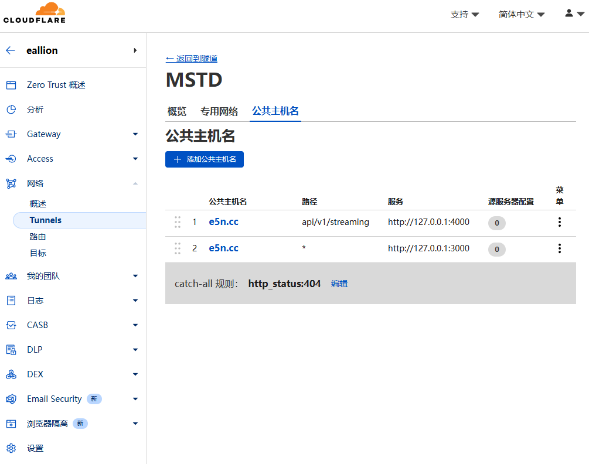

### 前言

我从 2017 年开始使用 Mastodon，见过各种牛鬼蛇神，也见过各种美好，联邦宇宙不是圣地，不是乌托邦，它没有那么美好，但它有一个我最喜欢的地方——自由。

去年简单地介绍了联邦宇宙和 Mastodon：

> https://www.eallion.com/fediverse/

这一年来陆陆续续有不少网友也加入了联邦宇宙，有不少人开始部署自己的 Mastodon 实例，为避免走弯路，节省时间，本文将介绍如何使用 Docker 部署 Mastodon。

### 注意

在开始之前，需要强调一下，这是中文用户常见的失误，一定要想好自己的用户名和域名。一旦加入联邦宇宙，用户名就是永久性的，不能更改，被别的实例 Fedi 了的数据，你没办法删除，你换了用户名和域名，之前的账号也还在。这是联邦宇宙的设计理念之一，也就是真正的去中心化，每个人对它的看法有褒有贬，但我个人非常认可这种理念。比如有些逃难来到联邦宇宙的用户，把他们的陋习也带来了，跟他们吵架的时候，他们是没办法抹除黑历史的。

### 准备工作

在开始之前，请确保需要部署的实例的规模：个人实例、小型社区还是大型社区。

本质上都是一样的部署方式，区别在于不同的规模可能需要不同的优化方案。

本文默认部署个人实例，或少数几个人用的小型社区。

### 前置条件

- 服务器：一台 VPS，2C2G 以上；
- 域名：一个域名，也可以是 social.example.com 这样的二级域名；
- Docker：安装 Docker 和 Compose 插件；
- 可选：s3 对象存储；
- 可选：Nginx、Caddy 或 Cloudflare Tunnels 反代。

### 部署 Mastodon

需要用到 2 个文件：

- `compose.yml` <- 也可以命名为：`docker-compose.yml`
- `.env.production` <- 空文件，后续用命令生成内容

用以下命令创建目录和文件：

```shell
mkdir mastodon
cd mastodon
touch compose.yml
touch .env.production
```

#### `compose.yml`

`compose.yml` 文件内容如下：（基本上就是[官方模板](https://github.com/mastodon/mastodon/blob/main/docker-compose.yml)）

1. postgres:14 我用的是我自己的优化版本，加了 repack 扩展，能更好地清理数据库碎片，提升性能：
   https://github.com/eallion/postgresql-14-alpine-pg-repack
2. 如果不需要搜索功能，可以用 `#` 注释掉 `es:` 部分，同时要检查其他服务 depends_on 是否有依赖 `es`，如果有也要注释掉。

```yaml
services:
  db:
    restart: always
    # image: postgres:14-alpine
    image: eallion/postgres:14-alpine
    shm_size: 256mb
    networks:
      - internal_network
    healthcheck:
      test: ['CMD', 'pg_isready', '-U', 'postgres']
    volumes:
      - ./postgres14:/var/lib/postgresql/data
    environment:
      - 'POSTGRES_HOST_AUTH_METHOD=trust'

  redis:
    restart: always
    image: redis:7-alpine
    networks:
      - internal_network
    healthcheck:
      test: ['CMD', 'redis-cli', 'ping']
    volumes:
      - ./redis:/data

  es:
    restart: always
    image: docker.elastic.co/elasticsearch/elasticsearch:7.17.27
    environment:
      - "ES_JAVA_OPTS=-Xms512m -Xmx512m -Des.enforce.bootstrap.checks=true"
      - "xpack.license.self_generated.type=basic"
      - "xpack.security.enabled=false"
      - "xpack.watcher.enabled=false"
      - "xpack.graph.enabled=false"
      - "xpack.ml.enabled=false"
      - "bootstrap.memory_lock=false"
      - "cluster.name=es-mastodon"
      - "discovery.type=single-node"
      - "thread_pool.write.queue_size=500"
    networks:
      - external_network
      - internal_network
    healthcheck:
      test: ["CMD-SHELL", "curl --silent --fail localhost:9200/_cluster/health || exit 1"]
    volumes:
      - ./elasticsearch:/usr/share/elasticsearch/data
    ulimits:
      memlock:
        soft: -1
        hard: -1
      nofile:
        soft: 65536
        hard: 65536
    ports:
      - '127.0.0.1:9200:9200'

  web:
    image: ghcr.io/mastodon/mastodon:latest
    restart: always
    env_file: .env.production
    command: bundle exec puma -C config/puma.rb
    networks:
      - external_network
      - internal_network
    healthcheck:
      # prettier-ignore
      test: ['CMD-SHELL', 'wget -q --spider --proxy=off localhost:3000/health || exit 1']
    ports:
      - '127.0.0.1:3000:3000'
    depends_on:
      - db
      - redis
      - es
    volumes:
      - ./public/system:/mastodon/public/system
    # 禁止 Watchtower 自动更新
    labels:
      - com.centurylinklabs.watchtower.enable=false

  streaming:
    image: ghcr.io/mastodon/mastodon-streaming:latest
    restart: always
    env_file: .env.production
    command: node ./streaming/index.js
    networks:
      - external_network
      - internal_network
    healthcheck:
      # prettier-ignore
      test: ['CMD-SHELL', "curl -s --noproxy localhost localhost:4000/api/v1/streaming/health | grep -q 'OK' || exit 1"]
    ports:
      - '127.0.0.1:4000:4000'
    depends_on:
      - db
      - redis
    # 禁止 Watchtower 自动更新
    labels:
      - com.centurylinklabs.watchtower.enable=false

  sidekiq:
    image: ghcr.io/mastodon/mastodon:latest
    restart: always
    env_file: .env.production
    command: bundle exec sidekiq
    depends_on:
      - db
      - redis
    networks:
      - external_network
      - internal_network
    volumes:
      - ./public/system:/mastodon/public/system
    healthcheck:
      test: ['CMD-SHELL', "ps aux | grep '[s]idekiq\ 6' || false"]
    # 禁止 Watchtower 自动更新
    labels:
      - com.centurylinklabs.watchtower.enable=false

networks:
  external_network:
  internal_network:
    internal: true
```

#### `.env.production`

用以下命令配置 Mastodon，生成 `.env.production` 文件：

```shell
docker compose run --rm web bundle exec rake mastodon:setup
```

按提示输入相关信息，会得到一个 `.env.production` 文件：

1. 如果是个人使用，建议将 `SINGLE_USER_MODE` 设置为 `true`
2. 如果要使用 S3 对象存储，取消注释相关配置，并填写相关信息
3. 如果部署在 `social.example.com` 这样的二级域名上，但想要一个 `@bob@example.com` 这样的账号，需要设置 `LOCAL_DOMAIN` 为 `example.com`，并将 `WEB_DOMAIN` 设置为 `social.example.com`，这很**重要**，后期不能更改。

```dotenv
# Generated with mastodon:setup on 2025-06-09 01:06:07 UTC

# Some variables in this file will be interpreted differently whether you are
# using docker compose or not.
ACTIVE_RECORD_ENCRYPTION_DETERMINISTIC_KEY=xx
ACTIVE_RECORD_ENCRYPTION_KEY_DERIVATION_SALT=xx
ACTIVE_RECORD_ENCRYPTION_PRIMARY_KEY=xx
LOCAL_DOMAIN=e5n.cc
LOCAL_HTTPS=true
WEB_DOMAIN=e5n.cc
# ALTERNATE_DOMAINS=mastodon.eallion.com
SINGLE_USER_MODE=true
RAILS_SERVE_STATIC_FILES=true
SECRET_KEY_BASE=xx
OTP_SECRET=xx
VAPID_PRIVATE_KEY=xx
VAPID_PUBLIC_KEY=xx
DB_HOST=db
DB_PORT=5432
DB_NAME=postgres
DB_USER=postgres
DB_PASS=xx
REDIS_HOST=redis
REDIS_PORT=6379
ES_ENABLED=true
ES_HOST=es
ES_PORT=9200
# CDN_HOST=https://assets.e5n.cc
##################################
# S3_ENABLED=true
# S3_OPEN_TIMEOUT=60
# S3_READ_TIMEOUT=60
# S3_PROTOCOL=https
# S3_ALIAS_HOST=files.e5n.cc
### Cloudflare R2
# S3_REGION=auto
# S3_BUCKET=mastodon
# AWS_ACCESS_KEY_ID=xx
# AWS_SECRET_ACCESS_KEY=xx
# S3_ENDPOINT=https://xx.r2.cloudflarestorage.com/
# S3_PERMISSION=''
##################################
SMTP_SERVER=smtp.gmail.com
SMTP_PORT=465
SMTP_LOGIN=xx
SMTP_PASSWORD=xx
SMTP_AUTH_METHOD=plain
SMTP_OPENSSL_VERIFY_MODE=none
SMTP_ENABLE_STARTTLS=auto
SMTP_FROM_ADDRESS=xx
```

初始化完成后，启动 Mastodon：

```shell
docker compose up -d
```

### 目录权限

停止 Mastodon：

```shell
docker compose down
```

然后修改目录的权限：

```shell
chown -R 1000:1000 elasticsearch
chown -R 991:991 public
chown -R 70:70 postgres14
```

### 创建管理员账号

通过 tootctl 工具建立管理员帐户：

```shell
docker exec mastodon-web-1 tootctl accounts create [USERNAME] --email [EMAIL] --confirmed --role Owner
```

### 反代

配置反代，一般使用 Nginx，我用的是 Cloudflare Tunnels。

#### Nginx 配置

参考官方的 [nginx.conf](https://github.com/mastodon/mastodon/blob/main/dist/nginx.conf) 模板：

将其中的 `example.com` 替换成自己的 `WEB_DOMAIN` 域名，将 20 和 43 行的 `/home/mastodon/live/public` 改成正确的目录，可用 `pwd` 查看，然后复制到虚拟主机中，使用宝塔或 1Panel 等面板需要手动手修改。
并用自己熟悉的方式配置 SSL 证书。

```nginx
map $http_upgrade $connection_upgrade {
  default upgrade;
  ''      close;
}

upstream backend {
    server 127.0.0.1:3000 fail_timeout=0;
}

upstream streaming {
    # Instruct nginx to send connections to the server with the least number of connections
    # to ensure load is distributed evenly.
    least_conn;

    server 127.0.0.1:4000 fail_timeout=0;
    # Uncomment these lines for load-balancing multiple instances of streaming for scaling,
    # this assumes your running the streaming server on ports 4000, 4001, and 4002:
    # server 127.0.0.1:4001 fail_timeout=0;
    # server 127.0.0.1:4002 fail_timeout=0;
}

proxy_cache_path /var/cache/nginx levels=1:2 keys_zone=CACHE:10m inactive=7d max_size=1g;

server {
  listen 80;
  listen [::]:80;
  server_name example.com;
  root /home/mastodon/live/public;
  location /.well-known/acme-challenge/ { allow all; }
  location / { return 301 https://$host$request_uri; }
}

server {
  listen 443 ssl http2;
  listen [::]:443 ssl http2;
  server_name example.com;

  ssl_protocols TLSv1.2 TLSv1.3;

  # You can use https://ssl-config.mozilla.org/ to generate your cipher set.
  # We recommend their "Intermediate" level.
  ssl_ciphers ECDHE-ECDSA-AES128-GCM-SHA256:ECDHE-RSA-AES128-GCM-SHA256:ECDHE-ECDSA-AES256-GCM-SHA384:ECDHE-RSA-AES256-GCM-SHA384:ECDHE-ECDSA-CHACHA20-POLY1305:ECDHE-RSA-CHACHA20-POLY1305:DHE-RSA-AES128-GCM-SHA256:DHE-RSA-AES256-GCM-SHA384:DHE-RSA-CHACHA20-POLY1305;

  ssl_prefer_server_ciphers on;
  ssl_session_cache shared:SSL:10m;
  ssl_session_tickets off;

  # Uncomment these lines once you acquire a certificate:
  # ssl_certificate     /etc/letsencrypt/live/example.com/fullchain.pem;
  # ssl_certificate_key /etc/letsencrypt/live/example.com/privkey.pem;

  keepalive_timeout    70;
  sendfile             on;
  client_max_body_size 99m;

  root /home/mastodon/live/public;

  gzip on;
  gzip_disable "msie6";
  gzip_vary on;
  gzip_proxied any;
  gzip_comp_level 6;
  gzip_buffers 16 8k;
  gzip_http_version 1.1;
  gzip_types text/plain text/css application/json application/javascript text/xml application/xml application/xml+rss text/javascript image/svg+xml image/x-icon;
  gzip_static on;

  location / {
    try_files $uri @proxy;
  }

  # If Docker is used for deployment and Rails serves static files,
  # then needed must replace line `try_files $uri =404;` with `try_files $uri @proxy;`.
  location = /sw.js {
    add_header Cache-Control "public, max-age=604800, must-revalidate";
    add_header Strict-Transport-Security "max-age=63072000; includeSubDomains";
    try_files $uri @proxy;
  }

  location ~ ^/assets/ {
    add_header Cache-Control "public, max-age=2419200, must-revalidate";
    add_header Strict-Transport-Security "max-age=63072000; includeSubDomains";
    try_files $uri @proxy;
  }

  location ~ ^/avatars/ {
    add_header Cache-Control "public, max-age=2419200, must-revalidate";
    add_header Strict-Transport-Security "max-age=63072000; includeSubDomains";
    try_files $uri @proxy;
  }

  location ~ ^/emoji/ {
    add_header Cache-Control "public, max-age=2419200, must-revalidate";
    add_header Strict-Transport-Security "max-age=63072000; includeSubDomains";
    try_files $uri @proxy;
  }

  location ~ ^/headers/ {
    add_header Cache-Control "public, max-age=2419200, must-revalidate";
    add_header Strict-Transport-Security "max-age=63072000; includeSubDomains";
    try_files $uri @proxy;
  }

  location ~ ^/packs/ {
    add_header Cache-Control "public, max-age=2419200, must-revalidate";
    add_header Strict-Transport-Security "max-age=63072000; includeSubDomains";
    try_files $uri @proxy;
  }

  location ~ ^/shortcuts/ {
    add_header Cache-Control "public, max-age=2419200, must-revalidate";
    add_header Strict-Transport-Security "max-age=63072000; includeSubDomains";
    try_files $uri @proxy;
  }

  location ~ ^/sounds/ {
    add_header Cache-Control "public, max-age=2419200, must-revalidate";
    add_header Strict-Transport-Security "max-age=63072000; includeSubDomains";
    try_files $uri @proxy;
  }

  location ~ ^/system/ {
    add_header Cache-Control "public, max-age=2419200, immutable";
    add_header Strict-Transport-Security "max-age=63072000; includeSubDomains";
    add_header X-Content-Type-Options nosniff;
    add_header Content-Security-Policy "default-src 'none'; form-action 'none'";
    try_files $uri @proxy;
  }

  location ^~ /api/v1/streaming {
    proxy_set_header Host $host;
    proxy_set_header X-Real-IP $remote_addr;
    proxy_set_header X-Forwarded-For $proxy_add_x_forwarded_for;
    proxy_set_header X-Forwarded-Proto $scheme;
    proxy_set_header Proxy "";

    proxy_pass http://streaming;
    proxy_buffering off;
    proxy_redirect off;
    proxy_http_version 1.1;
    proxy_set_header Upgrade $http_upgrade;
    proxy_set_header Connection $connection_upgrade;

    add_header Strict-Transport-Security "max-age=63072000; includeSubDomains";

    tcp_nodelay on;
  }

  location @proxy {
    proxy_set_header Host $host;
    proxy_set_header X-Real-IP $remote_addr;
    proxy_set_header X-Forwarded-For $proxy_add_x_forwarded_for;
    proxy_set_header X-Forwarded-Proto $scheme;
    proxy_set_header Proxy "";
    proxy_pass_header Server;

    proxy_pass http://backend;
    proxy_buffering on;
    proxy_redirect off;
    proxy_http_version 1.1;
    proxy_set_header Upgrade $http_upgrade;
    proxy_set_header Connection $connection_upgrade;

    proxy_cache CACHE;
    proxy_cache_valid 200 7d;
    proxy_cache_valid 410 24h;
    proxy_cache_use_stale error timeout updating http_500 http_502 http_503 http_504;
    add_header X-Cached $upstream_cache_status;

    tcp_nodelay on;
  }

  error_page 404 500 501 502 503 504 /500.html;
}
```

#### Cloudflare Tunnels 配置

1. 本机安装 Cloudflared

文档：[https://developers.cloudflare.com/cloudflare-one/connections/connect-networks/get-started/create-remote-tunnel/](https://developers.cloudflare.com/cloudflare-one/connections/connect-networks/get-started/create-remote-tunnel/)

我是用 Docker 部署的，以下是 `compose.yml` 文件内容：

```yaml
services:
  cloudflared:
    image: cloudflare/cloudflared:latest
    container_name: cloudflared
    command: tunnel --no-autoupdate run --token eyJh...
    restart: unless-stopped
    network_mode: host
```

2. 配置 Cloudflare Tunnnel

登录 Cloudflare Zero Trust 面板，找到你的 `Networks` > `Tunnels`，添加以下 2 个 `公共主机名` （即：`WEB_DOMAIN`）：

第 1 个：

- 子域：二级域名 或 空
- 域：你的域名
- 路径：`api/v1/streaming`
- 类型：HTTP
- URL：`127.0.0.1:4000`

第 2 个：

- 子域：二级域名 或 空
- 域：你的域名
- 路径：`/`
- 类型：HTTP
- URL：`127.0.0.1:3000`

然后将 `Streaming` 服务移到最上面，因为公共主机名是有顺序的。

如图：



### Relay 中继

Relay 中继的作用是将你的实例与其他实例连接起来，允许你接收和发送来自其他实例的内容。

常见的中文 Relay 中继有：

- https://relay.dragon-fly.club/inbox
- https://relay.nya.one/inbox
- https://relay.acg.mn/inbox
- https://mastodon-relay.moew.science/inbox
- https://relay.ie9.org/inbox
- https://relay.mstdn.one/inbox
- https://relay.jiong.us/inbox
- https://relay.neodb.net/inbox
- https://relay.c.im/inbox

### 内容保留

媒体缓存时间是指缓存别的实例的媒体内容的时间，根据自己的使用情况设置。

缓存过期后，媒体内容会被删除，但如果你重新查看别人的内容，会再次缓存。

自己上传的媒体内容会永久保留，除非你手动删除。

### 常用命令

常用的 [tootctl](https://docs.joinmastodon.org/admin/tootctl/) 命令都可以用下面的 docker 命令运行：

```shell
# 编译新的 JS 和 CSS 资产
docker compose run --rm web bundle exec rake assets:precompile

# 刷新所有账号
docker compose run --rm web tootctl accounts refresh --all --verbose

# 重建 elasticsearch
docker compose run --rm web tootctl search deploy
docker compose run --rm web tootctl search deploy --only=accounts

# 优化压缩 PostgreSQL 需要 pg_repack 插件
docker exec mastodon-db-1 psql -U postgres -d postgres -c "VACUUM;"
docker exec mastodon-db-1 psql -U postgres -d postgres -c "ANALYZE;"
docker exec mastodon-db-1 pg_repack -U postgres -d postgres

# 备份数据库，然后备份 name_of_the_backup.dump
docker exec mastodon-db-1 pg_dump -Fc -U postgres postgres > name_of_the_backup.dump

# 数据库迁移
docker compose run --rm web bundle exec rake db:migrate

# 清理文件
docker compose run --rm web tootctl media remove-orphans
docker compose run --rm web tootctl media remove --days=10
docker compose run --rm web tootctl media remove --days=10 --prune-profiles
docker compose run --rm web tootctl preview_cards remove --days=10
docker compose run --rm web tootctl statuses remove --days=10
docker compose run --rm web tootctl emoji purge --remote-only
```
