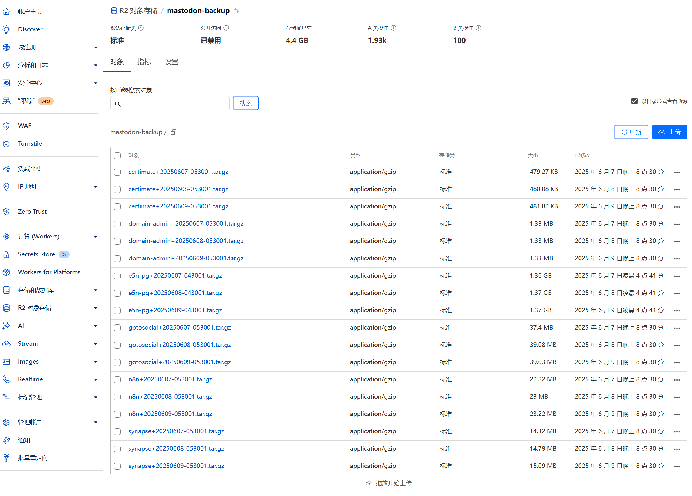

### 前言

《[Docker 部署 Mastodon](https://www.eallion.com/docker-deploy-mastodon/)》介绍了如何使用 Docker 部署 Mastodon，现在来分享一下我如何备份 Mastodon。

有一些面板带有备份功能，但我不喜欢用面板，面板也会占用额外的资源，也可能存在安全隐患，所以我使用了命令行来备份 Mastodon。

### 备份方案

- 备份工具：我用的是 [rclone](https://rclone.org/)，也可平替为其他同步工具
- 备份目的地：rclone 支持的目的地，我同时备份到 COS 和 R2
- 备份内容：Mastodon 的 PostgreSQL 数据库和其他需要备份的目录
- 备份频率：通过 `cron` 定时执行

### 安装配置 Rclone

1. 安装 Rclone，参考：<https://rclone.org/install/>
2. 生成 Rclone config

- https://developers.cloudflare.com/r2/examples/rclone/
- https://www.backblaze.com/docs/cloud-storage-integrate-rclone-with-backblaze-b2

Rclone 生成 Config 很简单，输入 `rclone config` 基本上就是一路选择或者保持默认就可以了。
以配置腾讯云 COS 为例，需要手动输入的是： `access_key_id` `secret_access_key` ：


最终会得到一份这样的 Config 文件：

```config
[B2]
...

[R2]
...

[COS]
type = s3
provider = TencentCOS
access_key_id = idididid
secret_access_key = keykey
endpoint = cos.ap-nanjing.myqcloud.com
```

通过命令 `rclone config paths` 可以查看这个 Config 保存在什么位置。
一般保存在 `~/.config/rclone/rclone.conf`。

### 备份脚本

以下是一个简单的备份脚本，保存为 `/home/debian_username/mastodon_backup.sh`，注意阅读脚本中的注释，修改相关路径和配置：

```bash
#!/bin/bash

# 设置需要备份的其他目录（绝对路径）
backup_dirs=(
	"/home/debian_username/docker/certimate:certimate"
	"/home/debian_username/docker/n8n:n8n"
)

# 同步的目的地，必须和 rclone.conf 配置的远程存储名称样同
remotes=("COS" "R2")
# 设置云存储桶名称
# 腾讯云 COS 的存储桶带有 APPID：mastodon-backup-1251444444
# 可以把其他平台的存储桶名称改为和腾讯云一样的格式
bucket_name="mastodon-backup-1251444444"

# 设置 Mastodon 备份文件名，临时使用，不重要
pg_dump_file="mstd_pg_backup.dump"

# 设置日期时间格式（示例：20231010-123045）
datetime=$(date +"%Y%m%d-%H%M%S")

# ================================================================

# 备份 PostgreSQL 数据库
# 备份前是否优化数据库（可选）
# docker exec mastodon-db-1 psql -U postgres -d postgres -c "VACUUM;"
# docker exec mastodon-db-1 psql -U postgres -d postgres -c "ANALYZE;"
# docker exec mastodon-db-1 pg_repack -U postgres -d postgres
docker exec mastodon-db-1 pg_dump -Fc -U postgres postgres > "${pg_dump_file}"
backup_dirs+=("${pg_dump_file}:pgsql")

# 创建备份文件
backup_files=()
for item in "${backup_dirs[@]}"; do
	dir=$(echo "$item" | cut -d':' -f1)
	prefix=$(echo "$item" | cut -d':' -f2)
	backup_file="${prefix}+${datetime}.tar.gz"

	if [[ "$prefix" == "pgsql" ]]; then
		# 处理PostgreSQL备份文件
		if [[ -f "$dir" ]]; then
			tar -czf "${backup_file}" -C "$(dirname "$dir")" "$(basename "$dir")"
			rm -f "${dir}"  # 删除临时导出的dump文件
			backup_files+=("${backup_file}")
		else
			echo "Warning: PostgreSQL dump file '$dir' does not exist. Skipping..."
		fi
	else
		# 处理目录备份
		if [[ -d "$dir" ]]; then
			tar -czf "${backup_file}" -C "$(dirname "$dir")" "$(basename "$dir")"
			backup_files+=("${backup_file}")
		else
			echo "Warning: Directory '$dir' does not exist. Skipping..."
		fi
	fi
done

# 同步到云存储，如果有多个远程存储，则用 for 循环同步
for remote in "${remotes[@]}"; do
	for file in "${backup_files[@]}"; do
		rclone copy "${file}" "${remote}:${bucket_name}/"
	done
done

# 删除本地备份文件
rm -f *.gz

echo "Backup completed and synced to cloud storage!"
```

### 定时任务

将备份脚本添加到 `cron` 定时任务中，使用 `crontab -e` 命令编辑定时任务：

```bash
# 每天凌晨 2 点执行备份脚本
0 2 * * * timeout 2h /bin/bash /home/debian_username/mastodon_backup.sh >> /home/debian_username/mastodon_backup.log 2>&1
```

### 结语

通过以上步骤，可以定期备份 Mastodon 的数据到云存储中，确保数据的安全性和可靠性。备份脚本可以根据实际需求进行调整，比如添加更多的目录备份、修改备份频率等。


