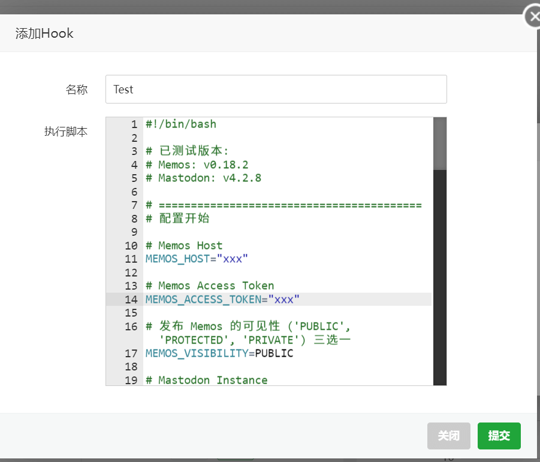

---
authors:
- eallion
categories:
- 代码
date: 2024-03-09 08:57:49
draft: false
series:
- Mastodon
seriesNavigation: true
series_weight: 2
slug: mastodon-sync-to-memos
summary: 该脚本通过 Webhook 实现 Mastodon 嘟文同步到 Memos 的功能，支持跳过回复和转嘟，利用 AI 检测内容相似度避免重复，并通过
  Sink 短网址服务生成跳转链接。配置需替换关键参数如 API 令牌和实例地址，脚本自动记录 ID 映射关系确保数据一致性。同步成功后会更新本地 JSON 文件并输出日志！
tags:
- Mastodon
- Memos
- Webhook
- 脚本
title: Mastodon 同步到 Memos
---
> 最新脚本：[https://gist.github.com/eallion/bf8861eb3292c2351c1067fba3198c26](https://gist.github.com/eallion/bf8861eb3292c2351c1067fba3198c26)

> Update 4：现在已改用 n8n 备份 Mastodon 嘟文，详见《[n8n 之备份 Mastodon 嘟文](https://www.eallion.com/n8n-backup-mastodon-statuses/)》

> Update 3：引入 ChatGPT AI (Deepseek) 来判断是否为重复内容

> Update 2：引入中间件 Sink 短网址服务，从 Memos `/m/{ID}` 链接跳转到 Mastodon

> Update 1：添加宝塔面板的示例。

### TL;DR

直接跳转到本页 [脚本内容](#%E8%84%9A%E6%9C%AC%E5%86%85%E5%AE%B9) 查看脚本代码。

### 前言

不知道是我运气好还是不好，在我准备把 Memos 当成主力工具加入到我的工作流中的时候，遇上了 `v0.19.0` 的版本更新，这次版本更新带来了一系列大坑。除了 Memos 新版本的鲁棒性备受质疑，甚至连搭载它的服务器本身也被影响，我在 64G 内存的物理机上都跑不动它。就像网友所说，Memos 只像是一个练手的项目。果断弃之。Google Keep、Obsidian 这些工具哪里不好了吗？不把所有事务约束在一个工具里确实是麻烦了一点，但是 All in one 基本上也等于是 All in boom。
现在我对 [Memos](https://memos.eallion.com/) 的定位是用来备份我的 [Mastodon](https://e5n.cc/@eallion)（方式之一）。

我一直喜欢 Webhook 这种主动式 Push 的方案，比 RSS、Cron 计划任务这些被动式 Pull 的方案简洁低碳环保，更具有即时性。主要是掌握主动的感觉让人觉得很爽。

下面开始介绍一下 Mastodon 利用 Webhook 同步嘟文到 Memos 的方法。我用的是 Shell Script 脚本，是一个很简单的脚本，只作了一些常识性的逻辑判断，可能不完美。用 Node.js、Python 等都可以实现。

### 已测试版本

- Memos: [`v0.22.3`](https://github.com/usememos/memos/pkgs/container/memos/218207833?tag=0.22.0)
- Mastodon: [`v4.2.10`](https://github.com/mastodon/mastodon/pkgs/container/mastodon/182724379?tag=v4.2.8)
- Sink: [`v0.1.3`](https://github.com/ccbikai/Sink/releases/tag/v0.1.3)

Mastodon 需要自己的实例，或者具有管理员权限能创建 Webhook 的账号才能使用此方法。

### 安装工具

请在服务器上安装工具，若有报错，请根据错误日志安装其他对应工具

- `sudo apt install jq`
- `sudo apt install lynx`

### Webhook 工具

- https://github.com/jkjoy/docker-webhook
- https://github.com/adnanh/webhook
- 宝塔面板 - 软件商店 - 搜索 Webhook 安装
- 1Panel - 未知

Mastodon 前往 `https://{INSTANCE}/admin/webhooks` 创建一个 Webhook。
事件可以只选 `status:created`，回复和转嘟也都算此事件喔。
目的地 URL 就填自己部署的 Webhook 的链接，如：`https://webhook.example.com/hooks/mastodon-sync-to-memos`
宝塔的是：`https://webhook.mybtserver.com:8888/hook?access_key=ACCESSKEY`
Mastodon 的 Webhook 目的地 URL 建议绑定域名，不然 Sidekiq 可能处理不了。


### 脚本内容

把下方的脚本内容保存到服务器上的一个 `.sh` 文件中，如当前用户的 Home 目录（`~`）的 [`~/mastodon_sync_to_memos.sh`](https://gist.github.com/eallion/bf8861eb3292c2351c1067fba3198c26#file-mastodon_sync_to_memos-sh) 文件中，并配置以下内容，请注意替换：

- `MEMOS_HOST=""`
- `MEMOS_ACCESS_TOKEN=""`
- `MEMOS_VISIBILITY=""`
- `MASTODON_INSTANCE=""`
- `MASTODON_ID=""`
- `SKIP_MASTODON_REPLY=`
- `SKIP_MASTODON_REBLOG=`
- `HOME_DIR=~`
- `FILE_PATH=$HOME_DIR/.mastodon_memos_id.json`
- `AI_DIFF=true`
- `AI_API="https://api.deepseek.com"`
- `AI_AUTHORIZATION=""`
- `SINK_HOST="https://s.e5n.cc"`
- `SINK_NUXT_SITE_TOKEN=""`

> 查找 Mastodon ID：https://`INSTANCE`/api/v1/accounts/lookup?acct=`USERNAME`

```bash
#!/bin/bash

sleep 5

# Version: 2024.07.22

# 已测试版本:
# Memos: v0.22.3
# Mastodon: v4.2.10
# Sink: v0.1.3

# ======================================================
# 配置开始

# Memos Host
MEMOS_HOST="https://memos.eallion.com/"

# Memos Access Token
MEMOS_ACCESS_TOKEN="eyJ***"

# 发布 Memos 的可见性 ('PUBLIC', 'PROTECTED', 'PRIVATE', 'VISIBILITY_UNSPECIFIED') 四选一
MEMOS_VISIBILITY=PUBLIC

# Mastodon Instance
MASTODON_INSTANCE="https://e5n.cc/"

# Mastodon ID, Find ID: https://INSTANCE/api/v1/accounts/lookup?acct=USERNAME
MASTODON_ID="111136231674527355"

# 跳过回复和转嘟
SKIP_MASTODON_REPLY=true
SKIP_MASTODON_REBLOG=true

# 获取当前用户的家目录路径及保存 ID 的文件，保持默认，不用更改
HOME_DIR=~
FILE_PATH=$HOME_DIR/.mastodon_memos_id.json

# AI 比较文本相似度
AI_DIFF=true
AI_API="https://api.deepseek.com"
AI_AUTHORIZATION="sk-***"

# Deploy Sink: https://github.com/ccbikai/Sink
SINK_HOST="https://s.e5n.cc"
SINK_NUXT_SITE_TOKEN="Sink***"

# 配置结束
# ======================================================

# 以下内容不用更改

# 检查 ID 文件是否存在
if [ ! -f "$FILE_PATH" ]; then
  # 如果文件不存在，则创建文件并写入 JSON 数据
  echo '
{
  "latest_memos_id": "0",
  "latest_mastodon_id": "0",
  "bind": []
}
' > "$FILE_PATH"
  echo "Data file created: $FILE_PATH"
else
  # 如果文件存在，则跳过并进行后续步骤
  echo "Local data exist, skipping..."
fi

# 拼接 Memos API 和 Token
if [[ "$MEMOS_HOST" != */ ]]; then
  MEMOS_HOST="$MEMOS_HOST/"
fi
MEMOS_API_HOST="${MEMOS_HOST}api/v1/memos"

# Memos 获取最新的 Memos ID
MEMOS_URL="${MEMOS_API_HOST}?creatorId=101&rowStatus=NORMAL&limit=1"
LATEST_MEMOS_ID=$(curl --connect-timeout 60 -s $MEMOS_URL | jq -r '.[0].id')

# Mastodon 的 API
if [[ "$MASTODON_INSTANCE" != */ ]]; then
  MASTODON_INSTANCE="$MASTODON_INSTANCE/"
fi
CONTENT_URL="${MASTODON_INSTANCE}api/v1/accounts/${MASTODON_ID}/statuses?limit=1&exclude_replies=${SKIP_MASTODON_REPLY}&exclude_reblogs=${SKIP_MASTODON_REBLOG}"

# 前置判断是否为回复嘟文，减少 AI Token 开支
LATEST_CONTENT_URL="${MASTODON_INSTANCE}api/v1/accounts/${MASTODON_ID}/statuses?limit=1"
LATEST_CONTENT_RESPONSE=$(curl -s "$LATEST_CONTENT_URL")
IS_REPLY=$(echo "$LATEST_CONTENT_RESPONSE" | jq -r '.[0].in_reply_to_id')
IS_REBLOG=$(echo "$LATEST_CONTENT_RESPONSE" | jq -r '.[0].reblog')
# 检查 IS_REPLY 是否为 null
if [ "$IS_REPLY" != "null" ]; then
  echo "Latest status is reply, exiting..."
  echo "Skipped: $(TZ=UTC-8 date +"%Y-%m-%d %T")"
  echo "============================="
  exit 0
fi
# 检查 IS_REBLOG 是否为 null
if [ "$IS_REBLOG" != "null" ]; then
  echo "Latest status is reblog, exiting..."
  echo "Skipped: $(TZ=UTC-8 date +"%Y-%m-%d %T")"
  echo "============================="
  exit 0
fi

# Mastodon 最新 Status 的 ID
LATEST_MASTODON_ID=$(curl --connect-timeout 60 -s $CONTENT_URL | jq -r '.[0].id')

# 定义 LOCAL_MEMOS_ID 变量
LOCAL_MEMOS_ID=$(cat "$FILE_PATH" | jq -r '.latest_memos_id')
LOCAL_MASTODON_ID=$(cat "$FILE_PATH" | jq -r '.latest_mastodon_id')

# Webhook 触发时，判断 Mastodon 最新 ID 是否为暂存 ID，防止重复同步
if [ "$LATEST_MASTODON_ID" == "$LOCAL_MASTODON_ID" ]; then
  echo "Mastodon no updated, skipping..."
  echo "Skipped: $(TZ=UTC-8 date +"%Y-%m-%d %T")"
  echo "============================="
  exit 0
fi

CONTENT=$(curl --connect-timeout 60 -s $CONTENT_URL | jq -r '.[0]')

MEDIA=$(echo $CONTENT | jq -r '.media_attachments')
# 判断 Media 的内容
if [ "$MEDIA" != "null" ]; then
  MEDIAS=$(echo $CONTENT | jq -r '.media_attachments[] | select(.type=="image") | .url')
  # 拼接图片
  images=""
  for url in $MEDIAS; do
    images="$images\n"
  done
  TEXT=$(echo "$CONTENT" | jq -r '.content' | lynx -dump -stdin -nonumbers -nolist | tr -d '\n' | sed '/^$/N;s/\n\n/\n/g' | sed 's/^[[:space:]]*//;s/[[:space:]]*$//' | sed -E 's/ {2,}/ /g')
  TEXT="$TEXT\n$images"
else
  # 普通内容
  TEXT=$(echo "$CONTENT" | jq -r '.content' | lynx -dump -stdin -nonumbers -nolist | tr -d '\n' | sed '/^$/N;s/\n\n/\n/g' | sed 's/^[[:space:]]*//;s/[[:space:]]*$//' | sed -E 's/ {2,}/ /g')
fi

# 判断内容是否为空
if [ -z "$TEXT" ] || [ "$TEXT" == "\\n" ]; then
  echo "Content is empty, skipping..."
  echo "Skipped: $(TZ=UTC-8 date +"%Y-%m-%d %T")"
  echo "============================="
  exit 0
fi

# 双引号转义
TEXT=$(echo "$TEXT" | sed 's/"/\\"/g')

# Webhook 触发时，判断 Memos 最新 ID 是否为暂存 ID
# 当 Memos 单方面有更新后，验证 Mastodon 和 Memos 的 ID 绑定关系（Todo）
# if [ "$LATEST_MEMOS_ID" == "$LOCAL_MEMOS_ID" ]; then
#  echo "Memos no updated, skipping..."
#  echo "Skipped: $(TZ=UTC-8 date +"%Y-%m-%d %T")"
#  echo "============================="
# exit 0
# fi

# 利用 Deepseek 对比 Mastodon 和 Memos 的相似度
CONTENT_MEMOS=$(curl --connect-timeout 60 -s $MEMOS_URL | jq '.[0].content')
CONTENT_MASTODON=$TEXT

if [[ "$AI_DIFF" == true ]]; then
    AI_RESPONSE=$(curl -L -X POST "$AI_API/chat/completions" \
    -H 'Content-Type: application/json' \
    -H 'Accept: application/json' \
    -H "Authorization: Bearer $AI_AUTHORIZATION" \
    --data-raw '{
      "messages": [
        {
          "content": "你是一个比较文本相似度的助手",
          "role": "system"
        },
        {
          "content": "比较```'"$CONTENT_MEMOS"'```和```'"$CONTENT_MASTODON"'```的相似度，超过 50% 的相似度就判定为相似，如果相似就回答数字 1，如果不相似就回答数字 0，除了数字 1 或者数字 0 不能回答其他任何内容。",
          "role": "user"
        }
      ],
      "model": "deepseek-coder",
      "frequency_penalty": 0,
      "max_tokens": 2048,
      "presence_penalty": 0,
      "stop": null,
      "stream": false,
      "temperature": 1,
      "top_p": 1,
      "logprobs": false,
      "top_logprobs": null
    }')
    AI_DIFF_RESULT=$(echo "$AI_RESPONSE" | jq -r '.choices[0].message.content')
    if [ "$AI_DIFF_RESULT" == 1 ]; then
      echo "[AI] Content is duplicate, skipping..."
      echo "Skipped: $(TZ=UTC-8 date +"%Y-%m-%d %T")"
      echo "============================="
      exit 0
    fi
else
    # 对比 Matodon 和 Memos 的 Content 内容的 MD5 值（不一定精确）

    # 获取最新 Memos 的 MD5
    LATEST_MEMOS_MD5=$(echo $CONTENT_MEMOS | tr -d '"' | md5sum | cut -d' ' -f1)
    # 获取最新 Mastodon 的 MD5
    LATEST_TEXT_MD5=$(echo $TEXT | tr -d '"' | md5sum | cut -d' ' -f1)

    # 通过 MD5 判断内容是否重复
    if [ "$LATEST_TEXT_MD5" == "$LATEST_MEMOS_MD5" ]; then
      echo "[MD5] Content is duplicate, skipping..."
      echo "Skipped: $(TZ=UTC-8 date +"%Y-%m-%d %T")"
      echo "============================="
      exit 0
    fi
fi

# 替换 NeoDB 的评分 Emoji
TEXT=$(echo "$TEXT" | sed "s/:star_empty:/🌑/g; s/:star_half:/🌗/g; s/:star_solid:/🌕/g")

# 去掉最末尾的空行
TEXT=$(echo "$TEXT" | sed 's/\\n$//')

# 发布 Memos 并获取返回的 JSON 数据
MEMOS_RESPONSE=$(curl --request POST \
  --url $MEMOS_API_HOST \
  --header "Authorization: Bearer $MEMOS_ACCESS_TOKEN" \
  --data "{
  \"content\": \"$TEXT\",
  \"visibility\": \"$MEMOS_VISIBILITY\"
}")

# 从返回的 JSON 数据中提取 Memos 的 id 值
NEW_MEMOS_ID=$(echo "$MEMOS_RESPONSE" | jq -r '.uid')

# 更新 JSON 文件中的 latest_memos_id 的值
jq ".latest_memos_id = \"$NEW_MEMOS_ID\"" "$FILE_PATH" > "${FILE_PATH}.tmp" && mv "${FILE_PATH}.tmp" "$FILE_PATH"

# 更新 JSON 文件中的 latest_mastodon_id 的值
jq ".latest_mastodon_id = \"$LATEST_MASTODON_ID\"" "$FILE_PATH" > "${FILE_PATH}.tmp" && mv "${FILE_PATH}.tmp" "$FILE_PATH"

# 更新 Mastodon 和 Memos 的 ID 的绑定关系，并确保 "bind" 中的数组保留唯一键，键也只有唯一值
jq ".bind += [{\"$LATEST_MASTODON_ID\": \"$NEW_MEMOS_ID\"}] | .bind = (.bind | unique)" "$FILE_PATH" > "${FILE_PATH}.tmp" && mv "${FILE_PATH}.tmp" "$FILE_PATH"

# POST 到 Sink
SINK_URL="${MASTODON_INSTANCE}@eallion/${LATEST_MASTODON_ID}"
SINK_SLUG="${NEW_MEMOS_ID}"

curl -s -X POST \
     -H "authorization: Bearer ${SINK_NUXT_SITE_TOKEN}" \
     -H "content-type: application/json" \
     -d "{\"url\": \"${SINK_URL}\", \"slug\": \"${SINK_SLUG}\"}" \
     "${SINK_HOST}/api/link/create"

echo "Sync Mastodon to Memos Successful!"
echo "Done: $(TZ=UTC-8 date +"%Y-%m-%d %T")"
echo "============================="
```

#### 宝塔面板

宝塔面板如果用 Webhook 插件，可以直接把上面的脚本内容复制到 Webhook 插件的脚本中。不用另外在服务器中手动创建 `.sh` 文件。



### JSON 数据文件内容

初次运行脚本，它会在当前用户的 Home 目录 `~` 新建一个文件 `~/.mastodon_memos_id.json` 并初始化，后续此文件会记录 Mastodon ID 和 Memos ID 的绑定关系。如果不想在 Home 目录创建，就需要修改 `HOME_DIR=` 和 `FILE_PATH=` 这两个参数。

```json
{
  "latest_memos_id": "",
  "latest_mastodon_id": "",
  "bind": []
}
```

生产环境产生数据后，示例：

```json
{
  "latest_memos_id": "JXByygyzXcDwPhTLqHTmWm",
  "latest_mastodon_id": "112833879053860314",
  "bind": [
    {
      "112485117943717939": "L9PF4hyXDa2BsW9GdeCRoH"
    },
    {
      "112486303537198423": "S4q7iMChrturdSa5YDXqvy"
    }
  ]
}
```
