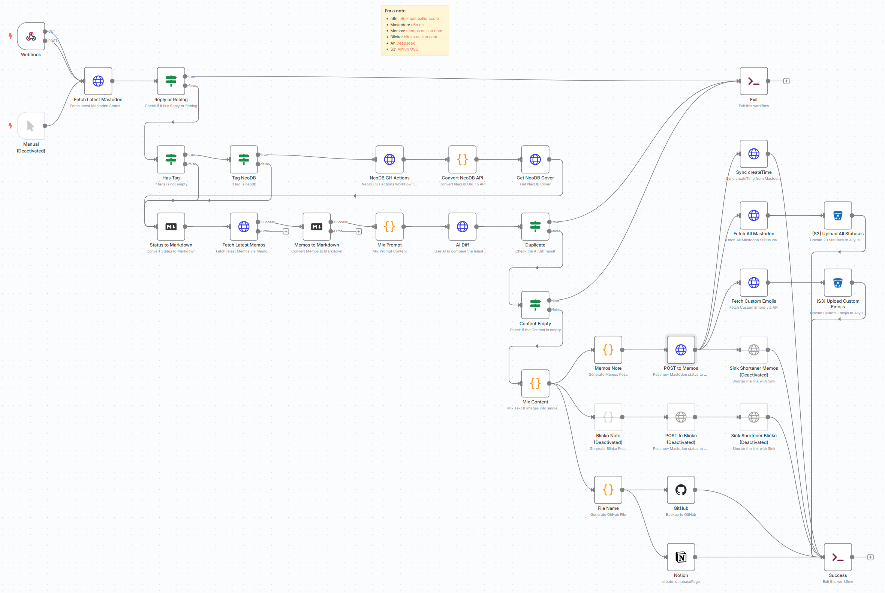
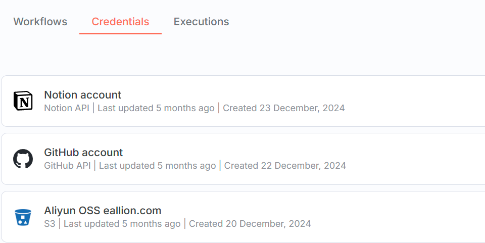
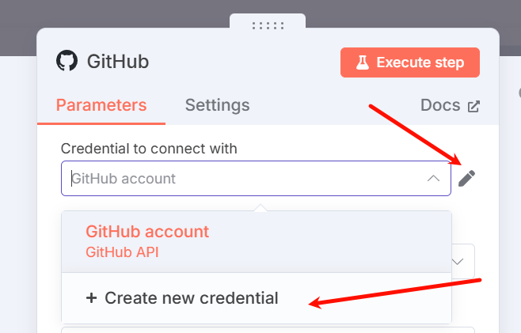
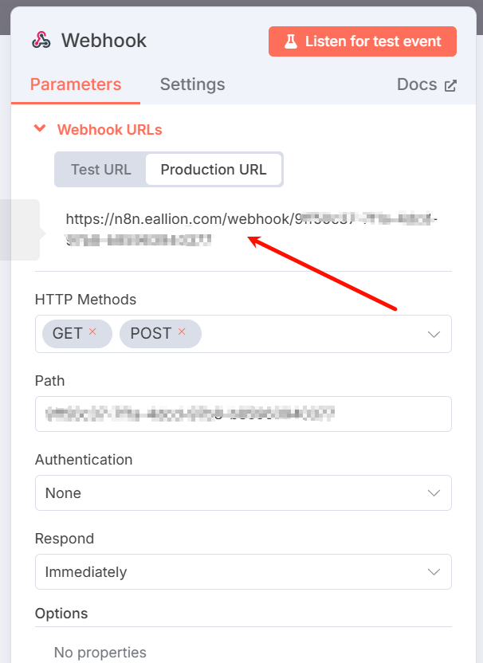
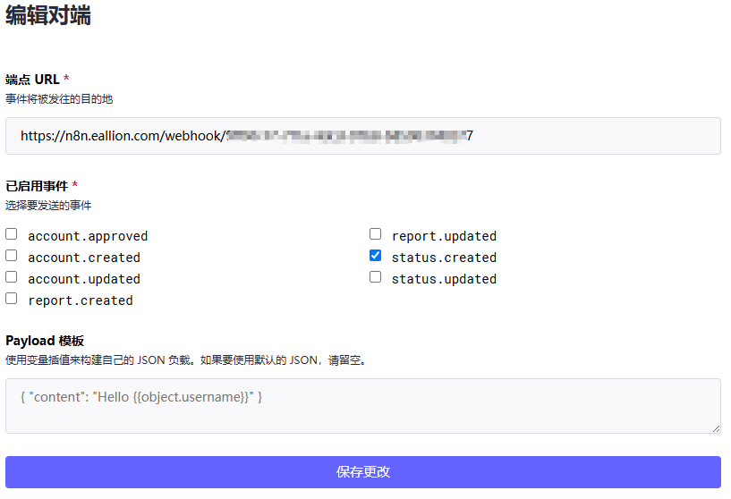
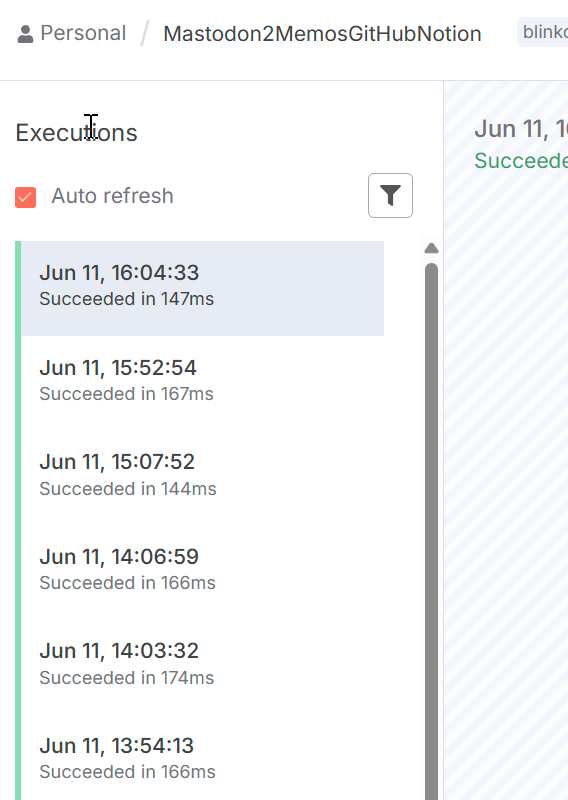

### 前言

以前体验过 n8n，但是源于自己的成见，觉得它的流程节点太多了，任何一个节点出问题都会影响到整个流程的鲁棒性。人总是健忘的，好比自己的博客，半年没写了，前两天突然打算写一篇博客，已经不知道怎么下手了，不是忘了这就是忘了那，打了 5 次补丁才把一篇文章按自己当初的博客要求给完成。
后来看到木木老师的《[Memos & n8n，秒接入 AI](https://immmmm.com/get-ai-memos/)》，我也决定再次部署 n8n 试试用它来备份 Mastodon 嘟文，半年下来很流畅，很稳定。

> 显示 Deactivated 的节点（灰色）表示已停用。

### 功能

#### 备份

这个 n8n 流程只能备份 Mastodon 嘟文（Statuses），不能备份评论和转发，随嘟文发布的 Media 文件会以 Markdown 的图片格式拼接到嘟文结尾来保存。不能备份 Mastodon 其他的内容。

#### 同步

它还具体同步的功能，可以把嘟文同步到 GitHub、Memos、Notion、Twitter 等平台，有些平台 n8n 原生支持，有些平台需要官方提供的 API 来创建 HTTP Request 节点。

#### 加速

一般来说，Mastodon 实例都部署在国外，通过 Cloudflare CDN 来加速，隐藏实例的 IP 地址。我通过添加了一个 s3 的 n8n 节点来对博客集成进行加速，把 Statuses 缓存到阿里云的 OSS 上。博客中集成的「[嘀咕](https://www.eallion.com/mastodon/)」和「[随手拍](https://www.eallion.com/album/)」页面访问的数据都是从 OSS 上获取的，访问速度会更快。

### 配置 n8n

#### 部署 n8n

n8n 的部署方式有很多种，Docker、Kubernetes、云服务等，这里就不赘述了。可以参考官方文档：[n8n 部署](https://docs.n8n.io/getting-started/installation/)

#### 配置凭证

在 n8n 面板中，点右上角的三角形，选择 Create Credentials，创建需要的凭证。
其他的平台，如：Memos、Blinko、Sink 没有官方的凭证，是通过 HTTP Request 节点来实现认证的。

我的流程中用到了以上几个节点，需要同步到其他平台，可模仿添加即可。

可选：也可以在编辑流程时，再根据需要来配置凭证：

#### 导入流程

我导出了我最新的 n8n 流程文件（已脱敏），在其他 n8n 中导入后，编辑凭证信息即可使用。

内容太长了，贴到 Gist 上：[n8n_sync_mastodon_to_memos_blinko_github_notion.json](https://gist.github.com/eallion/4e7ed09ab48b774628b21b9e67efe124)

除了下载这个文件导入外，更简便的方法是在 n8n 中新建一个 Workflow，在编辑器中，点击右上角的「Import from URL...」，填入 Gist 的 Raw 链接：`https://gist.githubusercontent.com/eallion/4e7ed09ab48b774628b21b9e67efe124/raw/de066041ba842ea98f3c3ea4c435cd8e7c76c1c9/n8n_sync_mastodon_to_memos_blinko_github_notion.json`

导入完成后，一定要双击点开每个节点编辑成自己的信息。

### 配置 Mastodon

现在可以配置 Mastodon 了，复制 n8n 流程中的 Webhook 节点 `Production URL`

然后在 Mastodon 的设置中，`管理` `Webhooks` `新增端点` 添加一个 Webhook，填入上面的 URL，启用事件选择：`status.created`，然后保存。

### 总结

如果一切配置正确，Mastodon 会在每次发布嘟文时（Reply 和 Boost 操作时也会触发，但已做好 Break 判断），向 n8n 的 Webhook 发送一个 POST 请求，触发 n8n 流程。

本流程包含以下动作：

- 检查是不是 Neodb 的标记
- 用 AI 对比 Mastodon 最新嘟文和 Memos 的最新 Memo 是否重复
- 优化处理文本内容
- 优化后的内容同步到 [Memos](https://memos.eallion.com) 中（含时间）
- 优化后的内容同步到 [GitHub](https://github.com/eallion/mastodon_statuses)
- 优化后的内容同步到 [Notion](https://eallion.notion.site/165d789fe4ec804f8bccf52c757c75d2)
- 优化后的内容同步到 Blinko（已弃用）
- 同步最新的 40（limit）条嘟文和 Emoji 到 S3 节点（阿里云 OSS），用于博客集成加速

其中，`Manual` 这个节点是用来手动触发流程的，测试的时候可以用它来模拟 Mastodon 的 POST 请求。测试时需要停用 `Webhook` 节点。

从运行历史看，流程运行正常，耗时在 160 毫秒左右：

### 注意事项

不要在短时间内频繁操作 Mastodon，比如不要非常快速的发布嘟文、回复或转发等，每次操作都会触发 n8n 流程，可能出现第二次操作时，第一次操作触发的流程还没完成的情况。
这会导致什么情况呢？因为流程中请求 Mastodon 的 API 时，是没有携带 Statuses ID 参数的，会导致短时间内多次请求同一内容，从而备份重复了。
初次设计这个流程时就想到了，但完成了一半了懒得改了，只要慢一点点就没事。

### Todo

- [ ] Webhook 触发时锁定 Statuses ID。
