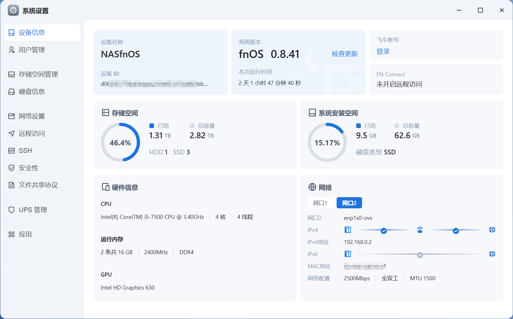
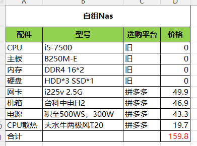
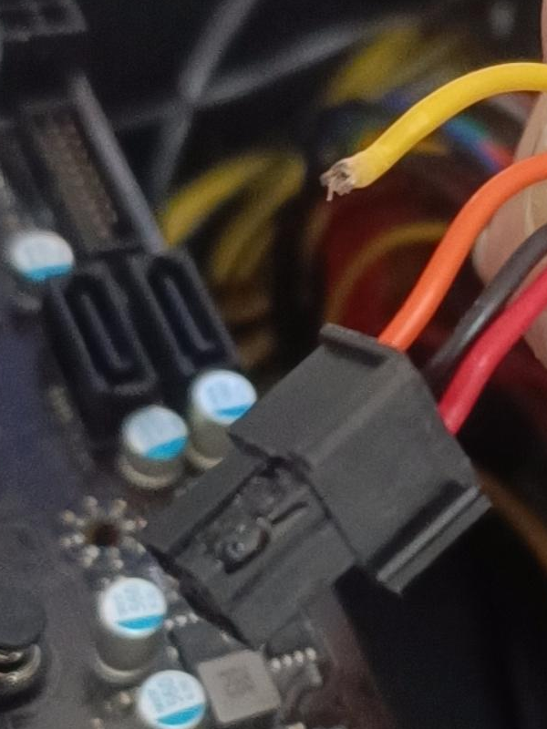

### 截图

### 源起

现在很火的飞牛 NAS，从去年公测了，就在 PVE 里面装了一个，体验了一下。感觉还可以。
后来又在 J4125 小主机上安装了一次，觉得硬件不太够，刚好家里有一些闲置的老硬件，就打算利用老硬件装一台物理机单独运行 NAS。
主要需求就是当作一台影视服务器，同时也兼作一台照片和文件备份服务器。
飞牛的影视服务做得还不错，家人也有随时查阅近期照片和一些合同文件的需求。外出时，Google Photos 和 Dropbox 还是没那么方便。

当时还发了一张[预算清单](https://e5n.cc/@eallion/114120432589048794)：

### 意外

#### 1. 意外一，没有 VGA 显示器

等了 3 天，所有配件都收到货了，开始装机。（怀念曾经在江浙沪的次日达。）
结果发现没有 VGA 显示器，一台显示器用的 DP 接口，另一台显示器用的 HDMI 接口。
这个时候已经是半夜了，在美团上下单一条 VGA 的线，打算等第二天早上到货后再装机。
收到线后傻眼了，显示器没有 VGA 接口，又在美团上下单了一个 VGA 转 HDMI 的转接头。
这次就很快了，只等了 30 分钟，就收到货了，心想这次终于可以装机了。
但是……
但是怎么也显示不出来，一直黑屏。BIOS 也进不了。心里一万只草泥马奔腾而过。
然后抱着主机，扫了个电驴，心想还是去电脑城找个店装机吧，万一不是显示器或线的问题，还能修一修。
电脑城的显示器插上就能用了。看到 BIOS 的界面，心里甚至还有一点点激动。
装系统要 30 块，但全程我自己在搞，只花了十几分钟，然后我说少点吧，老板娘让我扫了 20。

#### 2. 意外二，NAS 死机

回到家后，到晚饭时间了，就复制了点电影到 NAS 里，然后吃饭去了。
吃完饭回来，发现 NAS 死机了，Web 界面没有响应。
重启后，Debug 灯就卡在 CPU 和 内存这里来回闪。
排查了一下，没什么结果，主要是没有显示器。
但也不是完全没有结果，拔了一条内存，只插一根还是可以过 Debug，但还是一直会卡在 CPU 灯这里。

不过凭经验，CPU 是最不容易坏的三大件。
基本上是主板的问题，而且也在杂物间放了三四年。
那就先拆机，再配一张同型号的主板吧。不行就连 CPU 一起换。
但是我想赌一下，就赌是主板的问题，因为既然要连 CPU 一起换，那为什么不配一台全新的，用上 10 代以后的 CPU 呢。

拆机时，发现了一个离大谱的事情，电源的 24pin 接口，有一根线居然是他妈的断的！而且这个头子是变形的。
可能是鬼打墙了，装机时为什么没发现呢。这个变形我瞄了一眼的，我当时觉得应该不影响使用吧。

#### 3. 意外三，换主板和电源

当时我看到这根电源线，很想把买家骂一顿，但我只发了一张照片，再默默地点了退货。
然后去京东下单了一台最便宜的白牌认证电源，「大水牛」的「劲睿 500W」。
我知道有 20 块的拆机电源，但是吧……

主板淘了一张「微星」B250M PRO-V。

### 再装机

这次装机很顺利，一次点亮，但是老问题，没有显示器啊。
这时才想起来公司接打印机那台电脑的显示器应该是 VGA 接口的，那装系统也很顺利了。

### 配置清单

| 配件     | 型号                     | 平台                       | 价格       |
| -------- | ------------------------ | -------------------------- | ---------- |
| CPU      | i5 7500                  | 旧                         | 0          |
| 主板     | MSI B250M PRO-V          | 拼多多                     | 159.00     |
| 内存     | DDR4 8G x2               | 旧                         | 0          |
| 硬盘     | HHD x1  / SSD x3         | 旧                         | 0          |
| 网卡     | i255v 2.5G               | 拼多多                     | 49.90      |
| 机箱     | 台科中电 H2              | 拼多多                     | 43.30      |
| 电源     | 大水牛劲睿 500W          | 京东                       | 128.34     |
| UPS 电源 | Cyberpower UT650EGC 360W | 京东                       | 238.00     |
| 散热     | 大水牛两极风 T20         | 拼多多                     | 19.7       |
| VGA 线   | VGA                      | 美团（满 10 元配送凑单价） | 11.70      |
| 转接头   | VGA 转 HDMI              | 美团（满 10 元配送凑单价） | 12.89      |
| 装机     | -                        | 线下                       | 27.5       |
| 合计：   | -                        | -                          | **690.33** |

超预算：**￥530.53**。2.5G 网卡也是可有可无的。后续还得加硬盘。

### 总结

没事别瞎折腾。典型的为了这碟醋包了顿饺子。一旦开始了，前面花的钱就变成了沉没成本，不折腾完就白花了。很多需求是被创造出来的伪需求。
