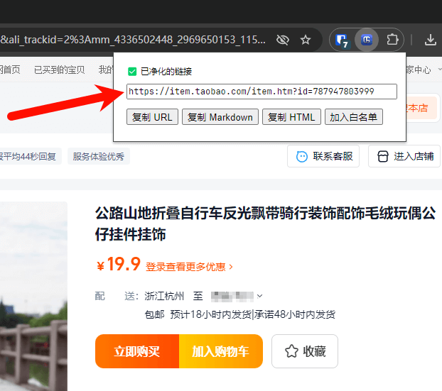

[网址净化器](https://chromewebstore.google.com/detail/npokdddpckpfhlecbgmplgcidebjmkfm) 是一个功能简单的工具：把当前标签页的网址净化成干净的网址。

原名：「净化淘宝链接」

开源：[https://github.com/eallion/url_cleaner](https://github.com/eallion/url_cleaner)

15 年前（大概 2009 年）的时候，开发过一款电商插件，用来净化淘宝的网址。那个时候我发现美工和客服都不太了解 URL 的机制，无论装修店铺的时候，还是发给客户的链接都很长，实际上只需要一个 `id=` 参数就可以了。我现在没有淘宝 C 店，以 Koobai 的淘宝店举例：

```text
https://item.taobao.com/item.htm?ak=33954624&ali_trackid=2%3Amm_4336502448
_2969650153_115008700494%3A1727011353022_557812494_0&bxsign=tbk9HQwEwb-mYc
KjlH3aYENXlTjcEhUVOqZBiHJhdVVPlxyp8HWxxmORIXwvXKhWvtaGuR7w9cxxkt3ZZq-AUdU1
gIXsry6y3RGeiAD_poGdbjps7xco9Kvaggm1ADFIHbcVMPsWr3vxzkX2wJ_0r6paZwQzCHHFWR
gUPhOIYi_7dA0bYBZwGjuaM1pLGuPP6Tq&fromUld=1&id=787947803999&pvid=33954624&
scm=20140767.59990_33_63_246_113_412_1727011349105.1%7Citem%7C832964446361
.0&spm=a2e0b.27129982.getcoupon.27129982&tkSid=1727011353022_557812494_0.0
&union_lens=lensId%3AOPT%401727011347%402132b868_12cd_19219e5db7f_2c64%400
22WoOODu4Xq3KoTC4wbyqm5%40eyJmbG9vcklkIjo4NTAwN30ie%3Brecoveryid%3A201_33.
8.187.243_14572015_1727011348782%3Bprepvid%3A201_33.8.187.243_14572015_172
7011348782
```

净化后的链接：

```text
https://item.taobao.com/item.htm?id=787947803999
```



而且，有的客服（还有运营）会做手脚，把里面阿里妈妈的 PID 更换成自己的，吃高佣淘宝客回扣，有同行半年可以吃出来一套房。

随着现在 Chrome Web Store Manifest V3 政策的更新，也把这个插件重构了一下，更新了一波。

- 迁移到 Manifest V3；
- 更新了插件名字（现在不仅限于净化淘宝链接了）；
- 更新了设置白名单，可以设置白名单，净化任何网址；
- 更新了图标，用 AI 生成了一个简单的图标。
- 支持 i18n；

现在内置白名单默认支持：

- `github.com`
- `*.1688.com`
- `*.aliyun.com`
- `*.baidu.com`
- `*.bing.com`
- `*.bilibili.com`
- `*.fliggy.com`
- `*.google.com`
- `*.jd.com`
- `*.jd.hk`
- `*.so.com`
- `*.taobao.com`
- `*.tmall.com`
- `*.tmall.hk`
- `*.yandex.com`
- `b23.tv`
- `cloud.tencent.com`

**小插曲**：发布 2.0.0 后，看到了 [@Viking](https://x.com/vikingmute) 的[这条推](https://x.com/vikingmute/status/1837016227585347897)，学到了 `field-sizing` 这个 CSS 属性。本来我在这个小细节上还调优了好久，没想到只需要一个 CSS 属性就能解决了，就去掉了相关的 JS 和 CSS，马上更新了这个参数，发布了 2.0.1 版本。

感兴趣的可以前往安装体验：
[https://chromewebstore.google.com/detail/npokdddpckpfhlecbgmplgcidebjmkfm](https://chromewebstore.google.com/detail/npokdddpckpfhlecbgmplgcidebjmkfm)

Todo：在线规则
