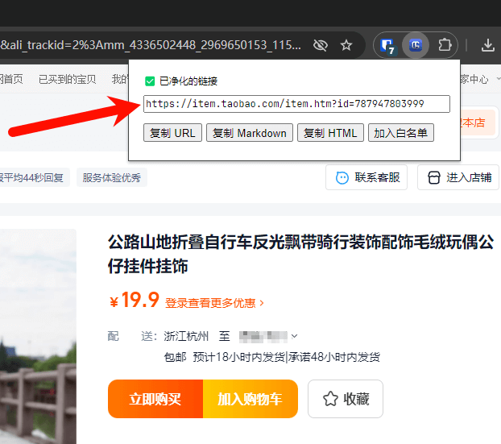

[URL Cleaner](https://chromewebstore.google.com/detail/npokdddpckpfhlecbgmplgcidebjmkfm) is a simple tool that purifies the current tab's URL into a clean URL.

Originally named: "Purify Taobao Links"

Open source: [https://github.com/eallion/url_cleaner](https://github.com/eallion/url_cleaner)

About 15 years ago (around 2009), I developed an e-commerce plugin to purify Taobao URLs. At that time, I found that designers and customer service representatives did not understand the mechanism of URLs very well. Whether it was during store decoration or when sending links to customers, the URLs were very long, while in fact, only an id= parameter was needed. I no longer have a Taobao C store, so I will use Koobai's Taobao store as an example:

```text
https://item.taobao.com/item.htm?ak=33954624&ali_trackid=2%3Amm_4336502448
_2969650153_115008700494%3A1727011353022_557812494_0&bxsign=tbk9HQwEwb-mYc
KjlH3aYENXlTjcEhUVOqZBiHJhdVVPlxyp8HWxxmORIXwvXKhWvtaGuR7w9cxxkt3ZZq-AUdU1
gIXsry6y3RGeiAD_poGdbjps7xco9Kvaggm1ADFIHbcVMPsWr3vxzkX2wJ_0r6paZwQzCHHFWR
gUPhOIYi_7dA0bYBZwGjuaM1pLGuPP6Tq&fromUld=1&id=787947803999&pvid=33954624&
scm=20140767.59990_33_63_246_113_412_1727011349105.1%7Citem%7C832964446361
.0&spm=a2e0b.27129982.getcoupon.27129982&tkSid=1727011353022_557812494_0.0
&union_lens=lensId%3AOPT%401727011347%402132b868_12cd_19219e5db7f_2c64%400
22WoOODu4Xq3KoTC4wbyqm5%40eyJmbG9vcklkIjo4NTAwN30ie%3Brecoveryid%3A201_33.
8.187.243_14572015_1727011348782%3Bprepvid%3A201_33.8.187.243_14572015_172
7011348782
```

The purified link is:

```text
https://item.taobao.com/item.htm?id=787947803999
```



Moreover, some customer service representatives (and operations staff) would manipulate the links by replacing the Ali Mama PID with their own to earn high commissions from Taobao affiliate rebates. Some competitors could earn enough in half a year to buy a house.

With the recent updates to the Chrome Web Store Manifest V3 policy, I also restructured this plugin and released an update.

- Migrated to Manifest V3;
- Updated the plugin name (now it is not limited to purifying Taobao links);
- Updated the whitelist settings, allowing users to set a whitelist to purify any URL;
- Updated the icon, generating a simple icon using AI;
- Supported i18n;

The built-in whitelist now supports the following by default:

- `github.com`
- `*.1688.com`
- `*.aliyun.com`
- `*.baidu.com`
- `*.bing.com`
- `*.bilibili.com`
- `*.fliggy.com`
- `*.google.com`
- `*.jd.com`
- `*.jd.hk`
- `*.so.com`
- `*.taobao.com`
- `*.tmall.com`
- `*.tmall.hk`
- `*.yandex.com`
- `b23.tv`
- `cloud.tencent.com`

A little side note: After releasing version 2.0.0, I saw [@Viking](https://x.com/vikingmute)'s [tweet](https://x.com/vikingmute/status/1837016227585347897) and learned about the field-sizing CSS property. I had spent a long time optimizing this small detail, but it turned out that just one CSS property could solve the issue. I removed the related JS and CSS, updated this parameter immediately, and released version 2.0.1.

If you're interested, you can go and install it to experience it:
[https://chromewebstore.google.com/detail/npokdddpckpfhlecbgmplgcidebjmkfm](https://chromewebstore.google.com/detail/npokdddpckpfhlecbgmplgcidebjmkfm)

Todo: Online rules
