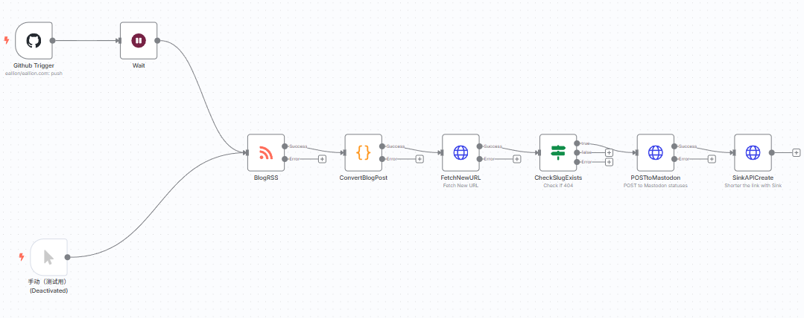
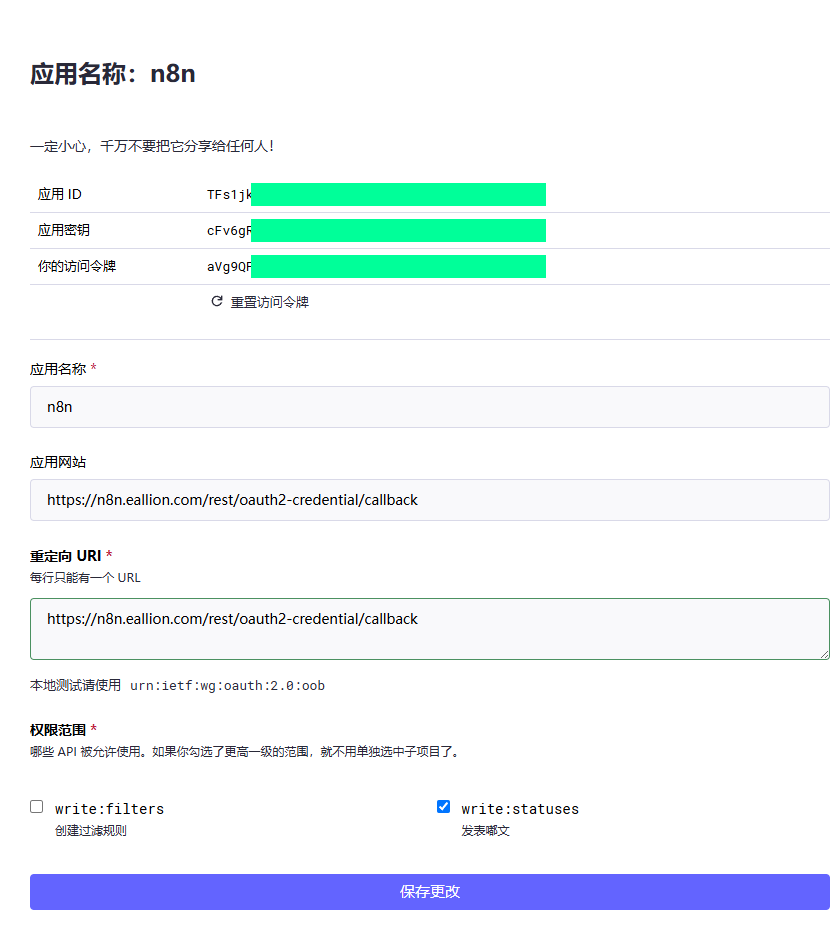
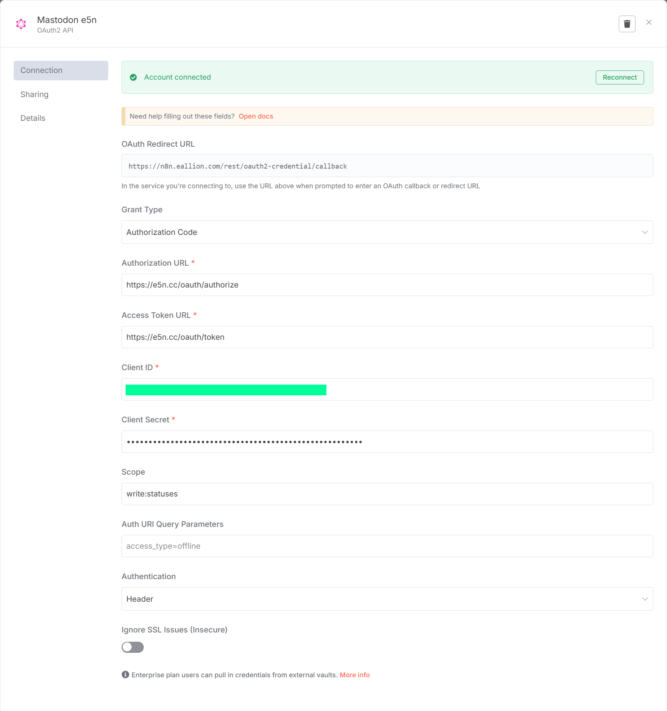

### 前言

有很多方式来同步博客内容到 Mastodon，比如我曾经就是使用的 GitHub Actions 在构建时就同步了。但我们不是已经部署了一个 n8n 吗？就把同步流程搬到 n8n 上了。

n8n 是一个强大的自动化工具，可以用来备份 Mastodon 嘟文——《[n8n 玩法之备份 Mastodon 嘟文](https://www.eallion.com/n8n-backup-mastodon-statuses/)》。今天我们来看看如何使用 n8n 将博客内容同步到 Mastodon。

### 流程简介

中间会引入 [Sink](https://github.com/ccbikai/sink) 短链接服务，Sink 也是判断博客文章是否是新发布的依据。用 Sink 来生成 Mastodon 嘟文的短链接，创建博客文章到 Mastodon 嘟文的联系，把一篇博客文章和一条嘟文对应起来，建立双向链接。见文末评论区的 `Discuss on Mastodon`。Hugo 的 Comments.html 模板中的代码：

```html
<a href="https://s.e5n.cc/{{ .Slug }}">Mastodon</a>
````

比如：
文章的 URL 是： `https://www.eallion.com/n8n-sync-blog-to-mastodon`
文章的 Slug 是： `n8n-sync-blog-to-mastodon`
Sink 短链接就是： `Sink 域名` + `Slug`：

- `https://sink.to/n8n-sync-blog-to-mastodon`

PS：n8n 中 Slug 提取代码：

```javascript
const path = originalLink.split('/').slice(3).join('/'); // 移除协议和域名部分
const slug = path.replace(/\/$/, ''); // 去除末尾的斜杠
```

### 具体流程



- 触发器：监测 GitHub 博客仓库的 Push
- 触发后睡眠 5 分钟，等待 CI/CD 构建和 CDN 刷新，根据自己的时间调整
- 获取博客 RSS 的内容
- 处理 RSS 最新的一条内容
- 检测最新内容的 Sink 短链接是否存在，`404` 表示这篇文章还没有在 Sink 创建过，即这篇文章是新发布的
- 如果 `404` 就发布到 Mastodon
- 发布后创建 Sink 短链接

### Mastodon 创建应用

在 Mastodon 实例中创建一个应用：

- `应用名称`： 随便填
- `应用网站`： `https://n8n.example.com/rest/oauth2-credential/callback`
- `重定向 URI`： `https://n8n.example.com/rest/oauth2-credential/callback`
- `权限范围`： `write:statuses`、可选 `write:media`



### n8n 凭证

在 n8n 面板中，点右上角的三角形，选择 Create Credentials，创建一个 Mastodon 凭证。

注意：Mastodon 不能用官方的，需要选择 OAuth2 API



### n8n 流程

复制这个流程代码，保存为 `.json` 文件，然后在 n8n 中导入。

```json
{
  "name": "SinkBlogtoMastodon",
  "nodes": [
    {
      "parameters": {
        "owner": {
          "__rl": true,
          "value": "gh_username",
          "mode": "name"
        },
        "repository": {
          "__rl": true,
          "value": "gh_blog_repo",
          "mode": "name"
        },
        "events": [
          "push"
        ],
        "options": {}
      },
      "type": "n8n-nodes-base.githubTrigger",
      "typeVersion": 1,
      "position": [
        -240,
        -420
      ],
      "id": "6ea99614-9c0f-49a7-88db-f552dbac7952",
      "name": "Github Trigger",
      "webhookId": "b33dca07-0939-4107-a315-231bfab13df3",
      "credentials": {
        "githubApi": {
          "id": "8qzxqmikk9WEzTtg",
          "name": "GitHub account"
        }
      }
    },
    {
      "parameters": {
        "url": "https://my.blog/rss",
        "options": {}
      },
      "type": "n8n-nodes-base.rssFeedRead",
      "typeVersion": 1.1,
      "position": [
        380,
        -120
      ],
      "id": "b48c23ba-ef9a-4c2a-8d0d-e73c0de35ec1",
      "name": "BlogRSS",
      "alwaysOutputData": true,
      "executeOnce": true,
      "retryOnFail": true,
      "onError": "continueErrorOutput"
    },
    {
      "parameters": {
        "url": "={{ $json.newLink }}",
        "options": {
          "response": {
            "response": {
              "fullResponse": true,
              "neverError": true
            }
          }
        }
      },
      "type": "n8n-nodes-base.httpRequest",
      "typeVersion": 4.2,
      "position": [
        900,
        -120
      ],
      "id": "9fe05f54-5107-40e4-b979-2e22e029d4cc",
      "name": "FetchNewURL",
      "alwaysOutputData": true,
      "executeOnce": true,
      "retryOnFail": true,
      "notesInFlow": true,
      "onError": "continueErrorOutput",
      "notes": "Fetch New URL"
    },
    {
      "parameters": {
        "conditions": {
          "options": {
            "caseSensitive": true,
            "leftValue": "",
            "typeValidation": "loose",
            "version": 2
          },
          "conditions": [
            {
              "id": "84ba6f92-1023-4902-997c-c6e3efd6ea38",
              "leftValue": "={{ $json.statusCode }}",
              "rightValue": "404",
              "operator": {
                "type": "string",
                "operation": "equals"
              }
            }
          ],
          "combinator": "and"
        },
        "looseTypeValidation": true,
        "options": {}
      },
      "type": "n8n-nodes-base.if",
      "typeVersion": 2.2,
      "position": [
        1160,
        -120
      ],
      "id": "fdf2464c-12c2-4ea8-85f5-f38ad9d0ff2a",
      "name": "CheckSlugExists",
      "executeOnce": true,
      "retryOnFail": true,
      "notesInFlow": true,
      "onError": "continueErrorOutput",
      "notes": "Check if 404"
    },
    {
      "parameters": {
        "method": "POST",
        "url": "https://sink.to/api/link/create",
        "sendHeaders": true,
        "headerParameters": {
          "parameters": [
            {
              "name": "authorization",
              "value": "Bearer ehJy..."
            },
            {
              "name": "content-type",
              "value": "application/json"
            }
          ]
        },
        "sendBody": true,
        "bodyParameters": {
          "parameters": [
            {
              "name": "url",
              "value": "={{ $json.body.uri }}"
            },
            {
              "name": "slug",
              "value": "={{ $('ConvertBlogPost').item.json.slug }}"
            }
          ]
        },
        "options": {}
      },
      "type": "n8n-nodes-base.httpRequest",
      "typeVersion": 4.2,
      "position": [
        1680,
        -120
      ],
      "id": "0b8ed4aa-ddba-4d1e-af96-24c39acb0b30",
      "name": "SinkAPICreate",
      "executeOnce": true,
      "retryOnFail": true,
      "notesInFlow": true,
      "notes": "Shorter the link with Sink"
    },
    {
      "parameters": {
        "jsCode": "// 获取 RSS 节点的第一条数据的 link\nconst originalTitle = $input.all()[0].json.title;\nconst originalLink = $input.all()[0].json.link;\nconst originalContent = $input.all()[0].json.content;\n\n// 替换域名为 s.e5n.cc\nconst newLink = originalLink.replace('www.eallion.com', 's.e5n.cc');\n\n// 提取 slug（例如 nas-building）\n// 使用字符串方法提取路径部分\nconst path = originalLink.split('/').slice(3).join('/'); // 移除协议和域名部分\nconst slug = path.replace(/\\/$/, ''); // 去除末尾的斜杠\n\n// 返回 newLink、originalLink 和 slug\nreturn [\n  {\n    json: {\n      originalTitle,\n      newLink,\n      originalLink,\n      slug,\n      originalContent,\n    },\n  },\n];"
      },
      "type": "n8n-nodes-base.code",
      "typeVersion": 2,
      "position": [
        640,
        -120
      ],
      "id": "2750e5ce-1a04-4cfd-bc53-27cd0aff166a",
      "name": "ConvertBlogPost",
      "executeOnce": true,
      "retryOnFail": true,
      "onError": "continueErrorOutput"
    },
    {
      "parameters": {
        "method": "POST",
        "url": "https://mastodon.instance/api/v1/statuses",
        "authentication": "genericCredentialType",
        "genericAuthType": "oAuth2Api",
        "sendBody": true,
        "bodyParameters": {
          "parameters": [
            {
              "name": "status",
              "value": "=博客发布新文章：《{{ $('ConvertBlogPost').item.json.originalTitle }}》\n{{ $('ConvertBlogPost').item.json.originalLink }}\n{{ $('ConvertBlogPost').item.json.originalContent }}"
            },
            {
              "name": "visibility",
              "value": "public"
            }
          ]
        },
        "options": {
          "response": {
            "response": {
              "fullResponse": true,
              "neverError": true
            }
          }
        }
      },
      "type": "n8n-nodes-base.httpRequest",
      "typeVersion": 4.2,
      "position": [
        1420,
        -120
      ],
      "id": "6f734551-c959-41e2-b05e-8691e76a265d",
      "name": "POSTtoMastodon",
      "notesInFlow": true,
      "executeOnce": true,
      "retryOnFail": true,
      "alwaysOutputData": true,
      "credentials": {
        "oAuth2Api": {
          "id": "GqNI5NcHBoCsIywV",
          "name": "Mastodon e5n"
        }
      },
      "onError": "continueErrorOutput",
      "notes": "POST to Mastodon statuses"
    },
    {
      "parameters": {},
      "type": "n8n-nodes-base.manualTrigger",
      "typeVersion": 1,
      "position": [
        -200,
        160
      ],
      "id": "f38321ef-5d2b-46b6-ad80-bb9ddda155eb",
      "name": "手动（测试用）",
      "disabled": true
    },
    {
      "parameters": {
        "unit": "minutes"
      },
      "type": "n8n-nodes-base.wait",
      "typeVersion": 1.1,
      "position": [
        40,
        -420
      ],
      "id": "4326ba6f-794e-420f-a961-998973c16989",
      "name": "Wait",
      "webhookId": "ad0849a8-63c0-4b84-97d8-86bfe59e3dab",
      "alwaysOutputData": true,
      "executeOnce": true,
      "retryOnFail": true,
      "notesInFlow": false
    }
  ],
  "pinData": {},
  "connections": {
    "Github Trigger": {
      "main": [
        [
          {
            "node": "Wait",
            "type": "main",
            "index": 0
          }
        ]
      ]
    },
    "BlogRSS": {
      "main": [
        [
          {
            "node": "ConvertBlogPost",
            "type": "main",
            "index": 0
          }
        ]
      ]
    },
    "FetchNewURL": {
      "main": [
        [
          {
            "node": "CheckSlugExists",
            "type": "main",
            "index": 0
          }
        ]
      ]
    },
    "CheckSlugExists": {
      "main": [
        [
          {
            "node": "POSTtoMastodon",
            "type": "main",
            "index": 0
          }
        ],
        [],
        []
      ]
    },
    "ConvertBlogPost": {
      "main": [
        [
          {
            "node": "FetchNewURL",
            "type": "main",
            "index": 0
          }
        ]
      ]
    },
    "POSTtoMastodon": {
      "main": [
        [
          {
            "node": "SinkAPICreate",
            "type": "main",
            "index": 0
          }
        ]
      ]
    },
    "手动（测试用）": {
      "main": [
        [
          {
            "node": "BlogRSS",
            "type": "main",
            "index": 0
          }
        ]
      ]
    },
    "Wait": {
      "main": [
        [
          {
            "node": "BlogRSS",
            "type": "main",
            "index": 0
          }
        ]
      ]
    }
  },
  "active": true,
  "settings": {
    "executionOrder": "v1"
  },
  "versionId": "f1aa189b-645b-44e1-906a-fdee06face62",
  "meta": {
    "templateCredsSetupCompleted": true,
    "instanceId": "f9ad6c4f03ea7c2c4f16a8dda8e47b847dcd27971aa32eadc1b11bbddddddddd"
  },
  "id": "KzVqqCxAGWaVZAmG",
  "tags": []
}
```
