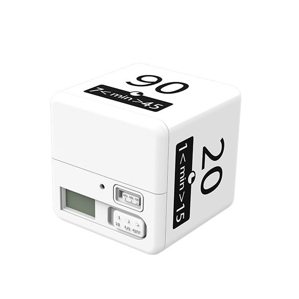
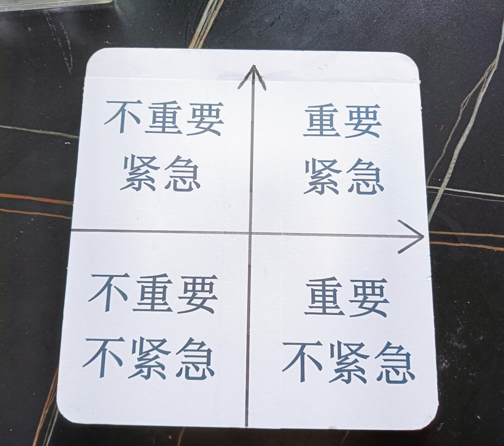
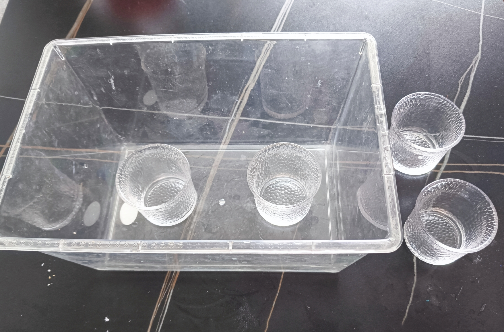

[Deepseek]
好的，这是将您的草稿转换成标准剧本格式后的版本。格式说明如下：

- **角色名：** 角色名称全大写，后面紧跟冒号。
- **对话：** 角色名下方的文本是该角色的台词。
- **舞台指示/动作提示：** 括号 `()` 内的内容表示动作、表情、语气或舞台说明。它们通常写在对应的台词上方或下方，单独成行。重要的动作（如倒水实验）会描述得更详细。
- **保留内容：** 所有原始台词和括号内的提示都已保留并转换到相应位置。
- **处理选项：** 对于爸爸的“说对/说错”选项，剧本格式通常需要确定一种表演方式。这里将“说对”的台词作为最终台词（更自然），但保留了“说错”作为注释（在 `[]` 内），方便导演或演员选择。最终表演时只选择一种。
- **合声：** 结尾的合声用 `爸爸 & 豆豆：` 表示。

------

剧本选题：《**时间管理大师**》

**人物：**

- **豆豆**（小名）（二年级）
- **爸爸**

**时间：**

🕖19:00 Jun 27, 2025

**地点：**

📍置地广场大舞台

**场景：舞台布置，设 1 桌，桌上置：**

- 1 水箱
- 2 空水杯（置于水箱内）
- 2 满水杯
- 1 艾森豪威尔矩阵板
- 1 翻转计时器
- 1 时间摆钟道具
- 1 纸笔

------

(主持人串场)

(协同科学实验工作室表演时间摆钟)

(演讲开场)

**豆豆：**
 你们家有没有这样的孩子，刷牙的时候忘记挤牙膏，到了学校又让你送作业。

**爸爸：**
 有啊，你上个学期不就是这样的孩子吗？

**豆豆：**
 这是因为没管理好时间，就让我们来一起学习时间管理。

**爸爸：**
 哦，说来我听听，时间又没长耳朵，它怎么听会你管理？

**豆豆：**
 老爸，你的耳朵倒是大，我觉得也不好管理呀。(梗) 我认为时间管理是非常有必要的，科学的使用时间会让做事的效率变高。就拿我来说：这个学期老爸负责送我上学。

**爸爸：**
 (拍拍自己，认可自己的负责) 是的啊，这个学期就是我送你上学。

**豆豆：**
 早上七点，闹钟一响，首先叫醒的不是我，而是老妈的唠叨声。妈妈温柔的唠叨声进入我的耳朵，就像小时候哄我睡觉的歌声，
 (唱歌) *一闪一闪亮晶晶，满天都是小星星...*
 让我昏昏入睡。

(爸爸也做出睡眠状)

**豆豆：**
 (惊醒) 这时！我的助理大智告诉我！

**爸爸：**
 (模仿机器人声音)“快起床了！要去奔赴自己的梦想哦!”

**豆豆：**
 就这样我的拉扯之战将会持续 10 分钟。

**爸爸：**
 你的意思是妈妈就不该喊你，是她给你制造了起床的障碍？

**豆豆：**
 这可是有科学依据的，我们会因为选择太多而陷入焦虑和拖延。妈妈的声音和闹钟的声音同时出现，使我错过了最佳的起床时间。

**爸爸：**
 那我们就把闹钟声留给你。让他成为你唯一的选择。看看下次你还怪谁？

**豆豆：**
 就这样我穿衣 10 分钟，刷牙洗脸 5 分钟。老妈说我刷牙刷不干净，我不同意她的看法，我说:“我把所有的刷牙时间都给了一颗牙齿，这要是都刷不干净，那不该怀疑我的能力，应该怀疑买到了假货。”

**爸爸：**
 我们不怀疑你的能力，我们怀疑你的智商，你满嘴就只有一颗牙吗？

**豆豆：**
 还有 5 分钟，好好享受老妈做得美味早餐。食物刚离开舌头还没有到达到胃里，就听见老爸的出门声。

(爸爸做出出门状)

(豆豆拍脚)
 一只鞋挂脚上，

(豆豆提鞋)
 一只鞋提手上赶紧

(豆豆跑步)
 冲向电梯。

(边说边归位)
 电梯就成了我的独家穿鞋区。

**爸爸：**
 每次这个时候，我就看着这个小男孩说:“小朋友起床晚了吧？我家孩子每次都赶在我前面出门。”
 (指) 你可要向我的儿子学习。
 (动作：说完倍儿有面子)

**豆豆：**
 面子你是有了，我爸却成别人老爸了。从起床到出门的 30 分钟，就是压缩版的人生黑暗和光明。所以我就决定要洗心革面，把老爸“抢”回来。

**爸爸：**
 还算有点长进。

**豆豆：**
 我选择了小学生自律神器来帮助我管理时间。

**爸爸：**
 还有这样的神器，说来听听是什么。

**豆豆：**
 (动作：手拿翻转计时器，展示)
 这个神器就是：翻转计时器。设定 5 分钟循环，完成一件事了就翻一下。起床 5 分钟，穿衣 5 分钟，洗漱 5 分钟，早餐 10 分钟，剩余 5 分钟穿戴整齐，神采奕奕的赶在老爸之前出门。学会这个方法后，井井有条的早晨给我带来一天的愉快。

**爸爸：**
 通过这个学期的观察，我发现你进步了不少，原来是你用了翻转计时器，你不再像上学期那样拖拉磨蹭了。

**豆豆：**
 (动作：给自己比大拇指)
 你看我现在变得可好了！

**爸爸：**
 合理管理时间让我看到了你的改变。

**豆豆：**
 我最近还学习了一个方法，叫青蛙先吃法，这种方法在网上也特别流行。

**爸爸：**
 青蛙？什么青蛙先吃法？是碳烤青蛙还是泡椒牛蛙？

**豆豆：**
 老爸，你这个大吃货，就知道吃。青蛙先吃法就是
 (动作：切)
 由难而易，先做困难的事，后面的事情就会变得非常简单了。

**爸爸：**
 (动作：怀疑的表情)
 还有这样的做法？! 要是第一件事就被难住了，那不卡关了吗？

**豆豆：**
 我给你说说，我上个星期天做作业的事情，你就明白了。上个星期一共 3 门作业，我先把最难的奥数给做了，虽然多花了一点时间，但其他的数学题和语文题就变得非常简单了。

**爸爸：**
 你这个方法不错，不过如果考试的时候先做最难的题，如果这道题不会的话就会占据大量的时间，后面简单的题目反而没时间做了，在规定的时间内反而考不了高分，这时候你这个青蛙先吃法反而成了副作用了嘛。

**豆豆：**
 虽然你前面说的话都很有道理，但是我还是坚持时间管理是非常有必要的，这不，我又发现了一个时间管理的好方案 - 艾森豪威尔矩阵。

**爸爸：**
 说对：艾森豪威尔矩阵是什么？听起来好厉害的样子。
 [​**​可选说错台词：​**​ 艾森豪威尔阵矩是什么？我只听说过艾森豪威尔矩阵。]

**豆豆：**
 艾森豪威尔矩阵也叫时间管理矩阵。就是我们可以提前罗列出要做的事情，再把要做事情按紧急程度和重要程度分成四个象限。
 (动作：数手指头，罗列。)
 第一部分：重要而且紧急的事情;
 第二部分：是重要但不紧急的事情;
 第三部分：是不重要但紧急的事情;
 第四部分：就是不重要不紧急的事情。

**爸爸：**
 那你能举个例子吗？

**豆豆：**
 比如说：我这个周末需要做四件事情，第一件事情是做作业，第二件事情是骑自行车锻炼，第三件事情是整理书包，第四件事情是理发。

**爸爸：**
 你认为哪件事又重要又紧急呢？

**豆豆：**
 我认为做作业是又重要又紧急的事情。

**爸爸：**
 (微微歪头，做出思考状)
 那理发呢？理发这件事，你怎么看？

**豆豆：**
 (摆摆手，语气轻松)
 理发啊，它既不太重要也不太紧急！万一时间来不及，下个周末再去理也没关系嘛！
 (耸肩，表示无所谓)

**爸爸：**
 (恍然大悟状，点点头)
 哦，我明白了！所以像骑自行车锻炼身体这种事，
 (用手比划着“重要”和“不紧急”两个维度)
 就属于重要但不紧急的事情，对吧？稍微晚一点去锻炼，也是可以的。

**豆豆：**
 (开心地拍手，赞同)
 (面向爸爸) 对对对！爸爸理解得真快！
 (转向观众，充满热情)
 看，学会了利用时间管理矩阵，我们就能把时间安排得明明白白啦！
 (双手张开，做一个展示的姿势)

**爸爸：**
 (微笑，带着一点探讨的意味)
 这个工具啊，就是非常有名的艾森豪威尔矩阵。不过，你知道吗？再好的工具也未必是十全十美的。

**豆豆：**
 (惊讶地瞪大眼睛，有点不服气)
 啊？这么厉害的工具，爸爸你还说它不完美？
 (叉腰，假装生气)
 那你说说看，它哪里不好啦？

**爸爸：**
 (温和地拍拍豆豆肩膀，解释)
 爸爸不是说它不好，而是想提醒你，你们小朋友啊，社会经验还在积累，阅历也还不够丰富。
 (语重心长)
 有时候，你们可能还没有足够的能力去准确判断一件事情到底是重要还是紧急。判断不准，做计划就容易出偏差啦。

**豆豆：**
 (歪着头，一脸疑惑)
 (语气天真)
 判断一件事是重要还是紧急？这还不简单吗？

**爸爸：**
 (摇摇头，举例说明)
 那可不一定哦！
 (模仿看手机)
 啊！等一下，我看看手机信息。
 (看手机，摇头)
 你看，我微信突然来了条消息，我都顾不上表演了，迫不及待地看看手机，结果只是一条快递通知！
 (耸肩摊手，表示无奈)
 生活中我们经常会被这种“虚假的紧急事件”给绑架了！

(豆豆用手比划“绑架”的动作)

**爸爸：**
 现在很多人都有这种毛病，这就是典型的错失恐惧症，没事就会划拉两下手机，老是以为有人在联系自己。有的人开车时都要看看手机。

**豆豆：**
 (若有所思地点点头)
 嗯...爸爸你这么一说，确实有道理。
 (认真地看着爸爸)
 如果人的想法不改变，光靠时间管理工具，好像确实不行。

**爸爸：**
 (露出神秘的微笑)
 你能想到这点，真棒！来，爸爸再带你做个小实验，你自己感受一下其中的道理。

(爸爸走到旁边准备好的小桌子旁，桌上放两个空杯子和一个水壶)

**爸爸：**
 看好喽！
 (开始倒水)
 我给这个杯子倒得快一点...

(爸爸快速向第一个杯子倒水，水花四溅)

**爸爸：**
 给这个杯子倒得慢一点...

(爸爸非常缓慢、平稳地向第二个杯子倒水，水流细而稳)
 你看它们有什么不一样？

**豆豆：**
 (凑近看，惊讶地指着杯子)
 咦？
 (指着第一个杯子)
 这个杯子怎么没满？
 (又指着第二个杯子)
 这个杯子反而装得满满的！这是怎么回事？
 (脸上充满好奇)

**爸爸：**
 (放下水壶，指着杯子，意味深长地说)
 你看，这就像《论语》里告诉我们的:「**欲速则不达，见小利，则大事不成。**」
 (缓慢而清晰地念出，可配合手势)
 意思是，很多事情啊，越着急，反而越达不到目的;
 (指着第一个杯子)
 就像这杯水一样，越贪图眼前的小快、小利，反而越成不了大事。虽然快代表了效率，
 (指着第二个杯子)
 (握拳表示力量)
 但有时候，慢才是真正的智慧。
 (张开手掌，表示包容和沉淀)

**豆豆：**
 (眼睛亮起来，仿佛明白了什么，转向观众)
 (充满感悟地说)
 我懂了！虽然我们小孩子现在还不能把自己的时间安排得特别完美，但就像一句名言说的：

**爸爸：**
 什么名言，洗耳恭听！

**豆豆：**
 (语气坚定)
 「**时间不在于你拥有多少，而在于你怎么使用。**」

**爸爸：**
 是的，任何事情都有两面性。合理运用工具才能管理好时间。

**豆豆：**
 我们只要根据自己的实际情况，用心去感受、去判断，就能合理安排好时间，让每一分每一秒都过得充实而有意义！
 (双手握拳放在胸前，充满信心)

**爸爸：**
 (赞许地看着豆豆，然后面向观众)
 说得好！
 (点头)
 希望我们每个人，都能在有限的时间里，找到自己的节奏，去做更多真正有意义的事情！

(爸爸和豆豆各张开一臂，做出展翅的姿势，同步)

**爸爸 & 豆豆：**
 让我们做一个时间管理大师吧！

**爸爸 & 豆豆：**
 谢谢大家！

**(鞠躬，结束)**
