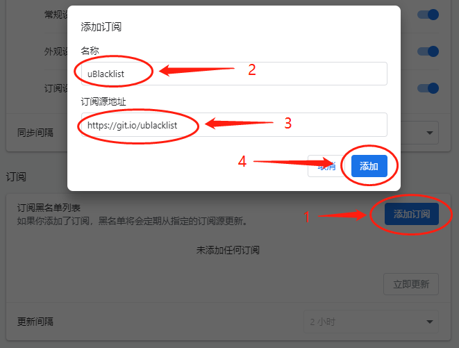

---
authors:
- eallion
categories:
- 代码
date: 2024-06-12 22:29:18+08:00
draft: false
slug: ublacklist-subscription-compilation
summary: 这是一个uBlacklist插件订阅合集，每周自动更新，专门屏蔽Google搜索结果中的中文SEO垃圾站和内容农场。订阅源地址为git.io/ublacklist。uBlacklist插件能通过匹配模式或正则表达式规则，阻止指定网站在搜索引擎结果中显示，
tags:
- ublacklist
- google
- 内容农场
- 搜索
- 插件
- 扩展
title: uBlacklist 订阅合集
---

### TL;DR

这是我维护的一个 uBlacklist 插件的订阅地址合集，搜集了网上大部分的订阅地址合并成一个。通过 [Github Actions](https://github.com/eallion/uBlacklist-subscription-compilation/actions/workflows/go.yml) 每周自动更新一次。
本订阅主要是屏蔽 Google 等搜索结果中的中文 SEO 垃圾站，如机器翻译、AI 生成的内容……

- 功能：🧱 **屏蔽中文内容农场！**【什么是[内容农场](https://zh.wikipedia.org/wiki/%E5%85%A7%E5%AE%B9%E8%BE%B2%E5%A0%B4)？】
- 插件： [iorate/ublacklist](https://github.com/iorate/ublacklist)
- 订阅源地址：`https://git.io/ublacklist`

### uBlacklist 插件

> [iorate/ublacklist](https://github.com/iorate/ublacklist) [介绍](https://github.com/iorate/ublacklist/blob/master/README.zh-CN.md#%E4%BB%8B%E7%BB%8D)

此扩展可防止您指定的网站出现在 Google 和其他的一些搜索引擎中。

您可以为搜索结果添加规则或点击工具栏图标以屏蔽指定的网站。规则可以通过以下方式指定：[匹配模式](https://developer.mozilla.org/zh-CN/docs/mozilla/add-ons/webextensions/match_patterns) (示例： `*://*.example.com/*`，这样的话会屏蔽 example.org 网站) 或使用[正则表达式](https://developer.mozilla.org/zh-CN/docs/web/javascript/guide/regular_expressions) (示例： `/example\.(net|org)/`，这样的话可以屏蔽 example.net 和 example.org 两个网站).

您可以通过云存储跨设备同步规则集。 目前，支持 Google Drive 和 Dropbox。

您还可以订阅公共规则集。 该网站列出了一些订阅：[https://iorate.github.io/ublacklist/subscriptions](https://iorate.github.io/ublacklist/subscriptions)

### 支持的搜索引擎

（由 [uBlacklist](https://github.com/iorate/ublacklist) 插件决定）

此扩展支持以下搜索引擎

|              | Web                | Images             | Videos             | News               |
| ------------ | ------------------ | ------------------ | ------------------ | ------------------ |
| Google       | :heavy_check_mark: | :heavy_check_mark: | :heavy_check_mark: | :heavy_check_mark: |
| Bing         | :heavy_check_mark: | :heavy_check_mark: | :heavy_check_mark: | :heavy_check_mark: |
| Brave \*3    | :heavy_check_mark: | :heavy_check_mark: | :heavy_check_mark: | :heavy_check_mark: |
| DuckDuckGo   | :heavy_check_mark: | :heavy_check_mark: | :heavy_check_mark: | :heavy_check_mark: |
| Ecosia       | :heavy_check_mark: |                    |                    |                    |
| Qwant        | :heavy_check_mark: | :heavy_check_mark: | \*1                | :heavy_check_mark: |
| SearX \*2    | :heavy_check_mark: | :heavy_check_mark: | :heavy_check_mark: | :heavy_check_mark: |
| Startpage    | :heavy_check_mark: |                    | :heavy_check_mark: | :heavy_check_mark: |
| Yahoo! JAPAN | :heavy_check_mark: |                    |                    |                    |
| Yandex       | :heavy_check_mark: |                    |                    |                    |

\*1 仅当 "Always play videos on Qwant.com" 关闭时；
\*2 仅支持某些公共实例，如果您想将自己的 SearX/SearXNG 添加到支持列表，你需要前往`src/common/search-engines.ts`，并手动将您的搜索引擎添加到列表中，然后手动进行构建；
\*3 由于获取图片链接的完整 URL 比较困难，此扩展程序不支持 Brave Image Search 中按子域名进行拦截。（例如，如果链接指向 `www.example.com`，则会拦截整个 `example.com`）。

### 用法

#### ⬇️ 1. 安装 uBlacklist

- Chrome: [Chrome Web Store](https://chrome.google.com/webstore/detail/ublacklist/pncfbmialoiaghdehhbnbhkkgmjanfhe)
- Firefox: [Firefox Add-ons](https://addons.mozilla.org/en-US/firefox/addon/ublacklist/)
- Safari (macOS / iOS): [App Store](https://apps.apple.com/us/app/ublacklist-for-safari/id1547912640)
- Edge*: [Chrome Web Store](https://chrome.google.com/webstore/detail/ublacklist/pncfbmialoiaghdehhbnbhkkgmjanfhe)

#### 🔧 2. 设置插件

> 测试版本：[v8.7.1](https://github.com/iorate/ublacklist/releases/tag/v8.7.1)

- 订阅源地址：`https://git.io/ublacklist`

打开插件的 `选项`，找到 `订阅`，在 `订阅黑名单列表` 点击 `添加订阅`，在弹出的对话框中将订阅源地址 `https://git.io/ublacklist` 填进去，`名称` 随便填，最后点击 `添加`。

如下图所示：



<blockquote>
订阅源地址的完整内容如下：

```bash
https://raw.githubusercontent.com/eallion/uBlacklist-subscription-compilation/main/uBlacklist.txt
```

```bash
# curl -I https://git.io/ublacklist

# HTTP/1.1 301 Moved Permanently
# cache-control: public, max-age=31536000, immutable
# x-lru-cache: HIT
location: https://raw.githubusercontent.com/eallion/uBlacklist-subscription-compilation/main/uBlacklist.txt
# content-length: 0
# date: 
# x-github-backend: Kubernetes
# x-github-request-id: 
```

</blockquote>

#### 🌐 3. 其他设置（选填）

- 设置 - 常规：

> 在谷歌的搜索结果中将不会显示以下网站
> 你可以使用 匹配模式 或 正则表达式。
> 要使用页面标题来屏蔽网站，请在正则表达式前添加「title」。
> 例如: *://*.example.com/*
> 例如: /example\.(net|org)/
> 例如: title/Example Domain/

```bash
*://*/so.php
*://*/so.php?s=*
*://*/cha.php?s=*
*://*/list.php?s=*
*://*/?s=*
*://*/so/*
```

- 其他搜索引擎 - `启用`