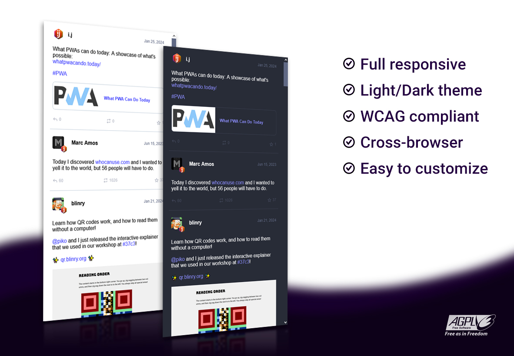

# 🐘 Mastodon embed timeline



Embed a mastodon timeline in your page, only with a CSS and JS file.

Demo running:
<https://codepen.io/ipuntoj/pen/MWppNGL>

## 📋 Table of contents

- [Installation](#installation)
  - [Download](#download)
  - [CDN](#cdn)
  - [Package manager](#package-manager)
- [Setup](#setup)
  - [Initialize](#initialize)
    - [Local timeline](#local-timeline)
    - [Profile timeline](#profile-timeline)
    - [Hashtag timeline](#hashtag-timeline)
  - [Customize](#customize)
- [API](#api)
- [Examples](#examples)

## Installation

You have three different ways to install it in your project, choose the one that best suits your needs:

### Download

Download into your project the following compiled and minified files:

- `dist/mastodon-timeline.min.css`
- `dist/mastodon-timeline.umd.js`

Now call the CSS and JS files in your HTML page using the `<link>` and `<script>` tags as follows in this example:

```html
<!DOCTYPE html>

<html lang="en">
  <head>
    <meta charset="UTF-8" />
    <meta name="viewport" content="width=device-width, initial-scale=1" />
    <title>Your site title</title>
    <!-- CSS -->
    <link href="path/to/mastodon-timeline.min.css" rel="stylesheet" />
  </head>

  <body>
    <!-- Your HTML content -->

    <!-- JavaScript -->
    <script src="path/to/mastodon-timeline.umd.js"></script>
    <script>
      // You can initialize the script here
    </script>
  </body>
</html>
```

### CDN

This option allows you to start without the need to upload any files on your server.  
Copy the following CSS and JS links to include them in your project:

```html
<link rel="stylesheet" href="https://cdn.jsdelivr.net/npm/@idotj/mastodon-embed-timeline@4.3.3/dist/mastodon-timeline.min.css" integrity="sha256-n6277x0TxwslF9uskcdwCPorYZnoSB9Wbv1O1w7Ahds=" crossorigin="anonymous">
```

```html
<script src="https://cdn.jsdelivr.net/npm/@idotj/mastodon-embed-timeline@4.3.3/dist/mastodon-timeline.umd.js" integrity="sha256-H+NYFuLL1tG4+iQmE5LRh5zBg1bToiCK/k4uJi4n3ks=" crossorigin="anonymous"></script>
```

### Package manager

A quick way to get it installed using **npm** or **yarn**:

```terminal
npm install @idotj/mastodon-embed-timeline
```

or

```terminal
yarn add @idotj/mastodon-embed-timeline
```

After installation, you can import the Javascript as follows:

```js
import * as MastodonTimeline from "@idotj/mastodon-embed-timeline";
```

Make sure to import also the file `mastodon-timeline.min.css` into your project.

## Setup

### Initialize

To get your timeline up add the following HTML structure in your page:

```html
<div id="mt-container" class="mt-container">
  <div class="mt-body" role="feed">
    <div class="mt-loading-spinner"></div>
  </div>
</div>
```

Then after that you can initialize the script by running:

```js
const myTimeline = new MastodonTimeline.Init();
```

By default it will show a timeline with 20 posts from the instance [mastodon.social](https://mastodon.social/public/local)

ℹ️ If you are trying to initialize the script before `mastodon-timeline.umd.js` is loaded, you will probably get such an error in the console:  
"_MastodonTimeline is not defined_".  
To fix that try to initialize the script as follow:

```js
window.addEventListener("load", () => {
  const myTimeline = new MastodonTimeline.Init();
});
```

The next step is to configure the options/values of your timeline according to the type you prefer. There are three types, **Local**, **Profile** and **Hashtag**. Here you have an example of each one to see how it works:

#### Local timeline

To show a timeline with posts from the instance [mastodon.online](https://mastodon.online/public/local) add the following option/value when initializing the timeline:

```js
const myTimeline = new MastodonTimeline.Init({
  instanceUrl: "https://mastodon.online",
});
```

#### Profile timeline

To show a timeline with posts from my Mastodon profile [@idotj](https://mastodon.online/@idotj) add the following options/values when initializing the timeline:

```js
const myTimeline = new MastodonTimeline.Init({
  instanceUrl: "https://mastodon.online",
  timelineType: "profile",
  userId: "000180745",
  profileName: "@idotj",
});
```

ℹ️ If you don't know your `userId` you have two ways to get it:

- Copy the url below and paste it in a new tab. Remember to replace the words `INSTANCE` and `USERNAME` with your current values in the url:  
  <https://INSTANCE/api/v1/accounts/lookup?acct=USERNAME>  
  The first value you see in the list is your `id` number.

- Click on the link below and put your `@USERNAME` and `@INSTANCE` in the input field:  
  [https://prouser123.me/mastodon-userid-lookup/](https://prouser123.me/mastodon-userid-lookup/)

#### Hashtag timeline

To show a timeline with posts containing the hashtag [#fediverse](https://mastodon.online/tags/fediverse) add the following options/values when initializing the timeline:

```js
const myTimeline = new MastodonTimeline.Init({
  instanceUrl: "https://mastodon.online",
  timelineType: "hashtag",
  hashtagName: "fediverse",
});
```

### Customize

In the `examples/` folder there is an HTML file `local-timeline-customized.html` where you can see how to customize your timeline by overwriting the CSS styles and using various JS options when initializing the timeline.

If you need to change something in the core files (`src/` folder), I recommend you to read the document [CONTRIBUTING.md](https://gitlab.com/idotj/mastodon-embed-timeline/-/blob/master/CONTRIBUTING.md#testing) to see how to compile and test your changes.

Here you have all the options available to quickly setup and customize your timeline:

```js
  // Id of the <div> containing the timeline
  mtContainerId: "mt-container",

  // Mastodon instance Url including https://
  instanceUrl: "https://mastodon.social",

  // Choose type of posts to show in the timeline: 'local', 'profile', 'hashtag'
  // Default: local
  timelineType: "local",

  // Your user ID number on Mastodon instance
  // Leave it empty if you didn't choose 'profile' as type of timeline
  userId: "",

  // Your user name on Mastodon instance (including the @ symbol at the beginning)
  // Leave it empty if you didn't choose 'profile' as type of timeline
  profileName: "",

  // The name of the hashtag (not including the # symbol)
  // Leave it empty if you didn't choose 'hashtag' as type of timeline
  hashtagName: "",

  // Class name for the loading spinner (also used in CSS file)
  spinnerClass: "mt-loading-spinner",

  // Preferred color theme: 'light', 'dark' or 'auto'
  // Default: auto
  defaultTheme: "auto",

  // Maximum number of posts to request to the server
  // Default: 20
  maxNbPostFetch: "20",

  // Maximum number of posts to show in the timeline
  // Default: 20
  maxNbPostShow: "20",

  // Specifies the format of the date according to the chosen language/country
  // Default: British English (day-month-year order)
  dateLocale: "en-GB",

  // Customize the date format using the options
  // Default: DD MMM YYYY
  dateOptions: {
    day: "2-digit",
    month: "short",
    year: "numeric",
  },

  // Hide unlisted posts
  // Default: don't hide
  hideUnlisted: false,

  // Hide boosted posts
  // Default: don't hide
  hideReblog: false,

  // Hide replies posts
  // Default: don't hide
  hideReplies: false,

  // Hide pinned posts from the profile timeline
  // Default: don't hide
  hidePinnedPosts: false,

  // Hide user account under the user name
  // Default: don't hide
  hideUserAccount: false,

  // Hide custom emojis available on the server
  // Default: don't hide
  hideEmojos: false,

  // Hide video image preview and load video player instead
  // Default: don't hide
  hideVideoPreview: false,

  // Hide preview card if post contains a link, photo or video from a Url
  // Default: don't hide
  hidePreviewLink: false,

  // Hide replies, boosts and favourites posts counter
  // Default: don't hide
  hideCounterBar: false,

  // Converts Markdown symbol ">" at the beginning of a paragraph into a blockquote HTML tag
  // Default: don't apply
  markdownBlockquote: false,

  // Limit the text content to a maximum number of lines
  // Default: 0 (unlimited)
  txtMaxLines: "0",

  // Customize the text of the button used for showing/hiding sensitive/spolier text
  btnShowMore: "SHOW MORE",
  btnShowLess: "SHOW LESS",

  // Customize the text of the button used for showing sensitive/spolier media content
  btnShowContent: "SHOW CONTENT",

  // Customize the text of the button pointing to the Mastodon page placed at the end of the timeline
  // Leave the value empty to hide it
  btnSeeMore: "See more posts at Mastodon",

  // Customize the text of the button reloading the list of posts placed at the end of the timeline
  // Leave the value empty to hide it
  btnReload: "Refresh",

  // Keep searching for the main <div> container before building the timeline. Useful in some cases where extra time is needed to render the page
  // Default: don't apply
  insistSearchContainer: false,

  // Defines the maximum time to continue searching for the main <div> container
  // Default: 3 seconds
  insistSearchContainerTime: "3000",

```

## API

| Function                  | Description                                                                     |
| ------------------------- | ------------------------------------------------------------------------------- |
| `mtColorTheme(themeType)` | Apply a theme color. `themeType` accepts only two values: `'light'` or `'dark'` |
| `mtUpdate()`              | Reload the timeline by fetching the lastest posts                               |

## Examples

The folder `examples/` contains several demos in HTML to play with. Download the full project and open each HTML file in your favorite browser.

Also, you have other alternatives to run these examples locally. Consult the document [CONTRIBUTING.md](https://gitlab.com/idotj/mastodon-embed-timeline/-/blob/master/CONTRIBUTING.md#testing) to use options such as Docker or Http-server.

## 🌐 Browser support

Mastodon embed timeline is supported on the latest versions of the following browsers:

- Chrome
- Firefox
- Edge
- Safari
- Brave
- Opera

## 🚀 Improve me

Feel free to add your features and improvements.  
Take a look at the [CONTRIBUTING.md](https://gitlab.com/idotj/mastodon-embed-timeline/-/blob/master/CONTRIBUTING.md) document to learn more about how to build and collaborate on the project.

## ⚖️ License

GNU Affero General Public License v3.0

## 💬 FAQ

Check the [closed issues](https://gitlab.com/idotj/mastodon-embed-timeline/-/issues/?sort=created_date&state=closed&first_page_size=20), you might find your question there.

If nothing matches with your problem, check the [open issues](https://gitlab.com/idotj/mastodon-embed-timeline/-/issues/?sort=created_date&state=opened&first_page_size=20) or feel free to create a new one.

Looking for a previous version of Mastodon embed timeline?  
Check on the tags list to see all the released versions: [Tags history](https://gitlab.com/idotj/mastodon-embed-timeline/-/tags)
